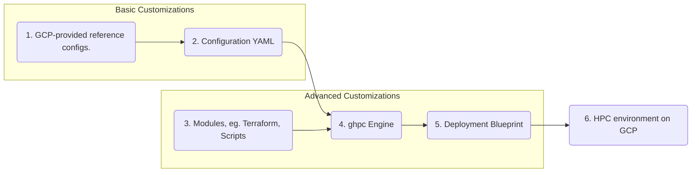

# Google HPC-Toolkit

## Description

HPC Toolkit is an open-source software offered by Google Cloud which makes it
easy for customers to deploy HPC environments on Google Cloud.

HPC Toolkit allows customers to deploy turnkey HPC environments (compute,
networking, storage, etc) following Google Cloud best-practices, in a repeatable
manner. The HPC Toolkit is designed to be highly customizable and extensible,
and intends to address the HPC deployment needs of a broad range of customers.

## Installation

These instructions assume you are using
[Cloud Shell](https://cloud.google.com/shell) which comes with the above
dependencies pre-installed (minus Packer which is not needed for this example).

To use the HPC-Toolkit, you must clone the project from GitHub and build the
`ghpc` binary.

You must first set up Cloud Shell to authenticate with GitHub. We will use an
SSH key.

> **_NOTE:_** You can skip this step if you have previously set up cloud shell
> with GitHub.\
> **_NOTE:_** You can find much more detailed instructions for this step in the
> [GitHub docs](https://docs.github.com/en/authentication/connecting-to-github-with-ssh).\
> **_NOTE:_** This step is only required during the private preview of the
> HPC-Toolkit.

```shell
# On Cloud Shell
ssh-keygen -t ed25519 -C "your_email@example.com"  # follow prompts
cat ~/.ssh/id_ed25519.pub                          # copy output
```

Use the output to add your Cloud Shell SSH key to GitHub by pasting your key [here](https://github.com/settings/ssh/new).

Next you will clone the HPC-Toolkit repo from GitHub.

```shell
git clone git@github.com:GoogleCloudPlatform/hpc-toolkit.git
```

Finally you build the toolkit.

```shell
cd hpc-toolkit && make
```

You should now have a binary named `ghpc` in the project root directory.
Optionally, you can run `./ghpc --version` to verify the build.

## Quick Start

To create a blueprint, an input YAML file needs to be written or adapted from
one of the [core examples](examples/) or
[community examples](community/examples/).

These instructions will use
[examples/hpc-cluster-small.yaml](examples/hpc-cluster-small.yaml), which is a
good starting point and creates a blueprint containing:

* a new network
* a filestore instance
* a slurm login node
* a slurm controller

> **_NOTE:_** More information on the example configs can be found in
> [examples/README.md](examples/README.md).

These instructions assume you are using
[Cloud Shell](https://cloud.google.com/shell) in the context of the GCP project
you wish to deploy in, and that you are in the root directory of the hpc-toolkit
repo cloned during [installation](#installation).

Run the ghpc binary with the following command:

```shell
./ghpc create examples/hpc-cluster-small.yaml --vars "project_id=${GOOGLE_CLOUD_PROJECT}"
```

> **_NOTE:_** The `--vars` argument supports comma-separated list of name=value
> variables to override YAML configuration variables. This feature only supports
> variables of string type.

This will create a blueprint directory named `hpc-cluster-small/`.

After successfully running `ghpc create`, a short message displaying how to
proceed is displayed. For the `hpc-cluster-small` example, the message will
appear similar to:

```shell
terraform -chdir=hpc-cluster-small/primary init
terraform -chdir=hpc-cluster-small/primary validate
terraform -chdir=hpc-cluster-small/primary apply
```

Use these commands to run terraform and deploy your cluster. If the `apply` is
successful, a message similar to the following will be displayed:

```shell
Apply complete! Resources: 13 added, 0 changed, 0 destroyed.
```

> **_NOTE:_** Before you run this for the first time you may need to enable some
> APIs and possibly request additional quotas. See
> [Enable GCP APIs](#enable-gcp-apis) and
> [Small Example Quotas](examples/README.md#hpc-cluster-smallyaml).\
> **_NOTE:_** If not using cloud shell you may need to set up
> [GCP Credentials](#gcp-credentials).\
> **_NOTE:_** Cloud Shell times out after 20 minutes of inactivity. This example
> deploys in about 5 minutes but for more complex deployments it may be
> necessary to deploy (`terraform apply`) from a cloud VM. The same process
> above can be used, although [dependencies](#dependencies) will need to be
> installed first.

Once the blueprint has successfully been deployed, take the following steps to run a job:

* First navigate to `Compute Engine` > `VM instances` in the Google Cloud Console.
* Next click on the `SSH` button associated with the `slurm-hpc-small-login0` instance.
* Finally run the `hostname` command on 3 nodes by running the following command in the shell popup:

```shell
$ srun -N 3 hostname
slurm-hpc-slurm-small-debug-0-0
slurm-hpc-slurm-small-debug-0-1
slurm-hpc-slurm-small-debug-0-2
```

By default, this runs the job on the `debug` partition. See details in
[examples/](examples/README.md#compute-partition) for how to run on the more
performant `compute` partition.

This example does not contain any Packer-based modules but for completeness,
you can use the following command to deploy a Packer-based deployment group:

```shell
cd <blueprint-directory>/<packer-group>/<custom-vm-image>
packer init .
packer validate .
packer build .
```

## HPC Toolkit Components

The HPC Toolkit has been designed to simplify the process of deploying a
familiar HPC cluster on Google Cloud. The block diagram below describes the
individual components of the HPC toolkit.



1. **GCP-provided reference configs** – A set of vetted reference configs can be
   found in the examples directory. These can be used to create a predefined
   blueprint for a cluster or as a starting point for creating a custom
   blueprint.
2. **Configuration YAML** – The primary interface to the HPC Toolkit is an input
   YAML file that defines which modules to use and how to customize them.
3. **gHPC Engine** – The gHPC engine converts the configuration YAML into a self-contained blueprint directory.
4. **HPC Modules** – The building blocks of a blueprint directory are the
   modules. Modules can be found in the ./modules and community/modules
   directories. They are composed of terraform, packer and/or script files that
   meet the expectationsof the gHPC engine.
5. **Deployment Blueprint** – A self-contained directory that can be used to
   deploy a cluster onto Google Cloud. This is the output of the gHPC engine.
6. **HPC environment on GCP** – After deployment of a blueprint, an HPC environment will be available in Google Cloud.

Users can configure a set of modules, and using the gHPC Engine of the HPC
Toolkit, they can produce a blueprint and deployment instructions for creating
those modules. Terraform is the primary method for defining the modules
behind the HPC cluster, but other modules based on tools like ansible and
Packer are available.

The HPC Toolkit can provide extra flexibility to configure a cluster to the
specifications of a customer by making the blueprints directly available and
editable before deployment. Any HPC customer seeking a quick on-ramp to building
out their infrastructure on GCP can benefit from this.

## GCP Credentials

### Supplying cloud credentials to Terraform

Terraform can discover credentials for authenticating to Google Cloud Platform
in several ways. We will summarize Terraform's documentation for using
[gcloud][terraform-auth-gcloud] from your workstation and for automatically
finding credentials in cloud environments. We do **not** recommend following
Hashicorp's instructions for downloading
[service account keys][terraform-auth-sa-key].

[terraform-auth-gcloud]: https://registry.terraform.io/providers/hashicorp/google/latest/docs/guides/getting_started#configuring-the-provider
[terraform-auth-sa-key]: https://registry.terraform.io/providers/hashicorp/google/latest/docs/guides/getting_started#adding-credentials

### Cloud credentials on your workstation

You can generate cloud credentials associated with your Google Cloud account
using the following command:

```shell
gcloud auth application-default login
```

You will be prompted to open your web browser and authenticate to Google Cloud
and make your account accessible from the command-line. Once this command
completes, Terraform will automatically use your "Application Default
Credentials."

If you receive failure messages containing "quota project" you should change the
quota project associated with your Application Default Credentials with the
following command and provide your current project ID as the argument:

```shell
gcloud auth application-default set-quota-project ${PROJECT-ID}
```

### Cloud credentials in virtualized cloud environments

In virtualized settings, the cloud credentials of accounts can be attached
directly to the execution environment. For example: a VM or a container can
have [service accounts][https://cloud.google.com/iam/docs/service-accounts]
attached to them. The Google [Cloud Shell][cloud-shell] is an interactive
command line environment which inherits the credentials of the user logged in
to the Google Cloud Console.

[cloud-shell]: https://console.cloud.google.com/home/dashboard?cloudshell=true
[cloud-shell-limitations]: https://cloud.google.com/shell/docs/quotas-limits#limitations_and_restrictions

Many of the above examples are easily executed within a Cloud Shell environment.
Be aware that Cloud Shell has [several limitations][cloud-shell-limitations],
in particular an inactivity timeout that will close running shells after 20
minutes. Please consider it only for small blueprints that are quickly
deployed.

## Blueprint Warnings and Errors

By default, each blueprint is configured with a number of "validator" functions
which perform basic tests of your global variables. If `project_id`, `region`,
and `zone` are defined as global variables, then the following validators are
enabled:

```yaml
validators:
- validator: test_project_exists
  inputs:
    project_id: $(vars.project_id)
- validator: test_region_exists
  inputs:
    project_id: $(vars.project_id)
    region: $(vars.region)
- validator: test_zone_exists
  inputs:
    project_id: $(vars.project_id)
    zone: $(vars.zone)
- validator: test_zone_in_region
  inputs:
    project_id: $(vars.project_id)
    zone: $(vars.zone)
    region: $(vars.region)
```

This configures validators that check the validity of the project ID, region,
and zone. Additionally, it checks that the zone is in the region. Validators can
be overwritten, however they are limited to the set of functions defined above.

Validators can be explicitly set to the empty list:

```yaml
validators: []
```

They can also be set to 3 differing levels of behavior using the command-line
`--validation-level` flag` for the `create` and `expand` commands:

* `"ERROR"`: If any validator fails, the blueprint will not be
    written. Error messages will be printed to the screen that indicate which
    validator(s) failed and how.
* `"WARNING"` (default): The blueprint will be written even if any validators
    fail. Warning messages will be printed to the screen that indicate which
    validator(s) failed and how.
* `"IGNORE"`: Do not execute any validators, even if they are explicitly
    defined in a `validators` block or the default set is implicitly added.

For example, this command will set all validators to `WARNING` behavior:

```shell
./ghpc create --validation-level WARNING examples/hpc-cluster-small.yaml
```

The flag can be shortened to `-l` as shown below using `IGNORE` to disable all
validators.

```shell
./ghpc create -l IGNORE examples/hpc-cluster-small.yaml
```

## Enable GCP APIs

In a new GCP project there are several apis that must be enabled to deploy your
HPC cluster. These will be caught when you perform `terraform apply` but you can
save time by enabling them upfront.

List of APIs to enable ([instructions](https://cloud.google.com/apis/docs/getting-started#enabling_apis)):

* Compute Engine API
* Cloud Filestore API
* Cloud Runtime Configuration API - _needed for `high-io` example_

## GCP Quotas

You may need to request additional quota to be able to deploy and use your HPC
cluster. For example, by default the `SchedMD-slurm-on-gcp-partition` module
uses `c2-standard-60` VMs for compute nodes. Default quota for C2 CPUs may be as
low as 8, which would prevent even a single node from being started.

Required quotas will be based on your custom HPC configuration. Minimum quotas
have been [documented](examples/README.md#example-configs) for the provided examples.

Quotas can be inspected and requested at `IAM & Admin` > `Quotas`.

## Troubleshooting

### Failure to Create Auto Scale Nodes (Slurm)

If your deployment succeeds but your jobs fail with the following error:

```shell
$ srun -N 6 -p compute hostname
srun: PrologSlurmctld failed, job killed
srun: Force Terminated job 2
srun: error: Job allocation 2 has been revoked
```

Possible causes could be [insufficient quota](#insufficient-quota) or
[placement groups](#placement-groups). Also see the
[Slurm user guide](https://docs.google.com/document/u/1/d/e/2PACX-1vS0I0IcgVvby98Rdo91nUjd7E9u83oIMCM4arne-9_IdBg6BdV1lBpUcSje_PyHcbAaErC1rY7p4u1g/pub).

#### Insufficient Quota

It may be that you have sufficient quota to deploy your cluster but insufficient
quota to bring up the compute nodes.

You can confirm this by SSHing into the `controller` VM and checking the
`resume.log` file:

```shell
$ cat /var/log/slurm/resume.log
...
resume.py ERROR: ... "Quota 'C2_CPUS' exceeded. Limit: 300.0 in region europe-west4.". Details: "[{'message': "Quota 'C2_CPUS' exceeded. Limit: 300.0 in region europe-west4.", 'domain': 'usageLimits', 'reason': 'quotaExceeded'}]">
```

The solution here is to [request more of the specified quota](#gcp-quotas),
`C2 CPUs` in the example above. Alternatively, you could switch the partition's
[machine type][partition-machine-type], to one which has sufficient quota.

[partition-machine-type]: community/modules/compute/SchedMD-slurm-on-gcp-partition/README.md#input_machine_type

#### Placement Groups

By default, placement groups (also called affinity groups) are enabled on the
compute partition. This places VMs close to each other to achieve lower network
latency. If it is not possible to provide the requested number of VMs in the
same placement group, the job may fail to run.

Again, you can confirm this by SSHing into the `controller` VM and checking the
`resume.log` file:

```shell
$ cat /var/log/slurm/resume.log
...
resume.py ERROR: group operation failed: Requested minimum count of 6 VMs could not be created.
```

One way to resolve this is to set [enable_placement][partition-enable-placement]
to `false` on the partition in question.

[partition-enable-placement]: https://github.com/GoogleCloudPlatform/hpc-toolkit/tree/main/community/modules/compute/SchedMD-slurm-on-gcp-partition#input_enable_placement

### Terraform Deployment

When `terraform apply` fails, Terraform generally provides a useful error
message. Here are some common reasons for the deployment to fail:

* **GCP Access:** The credentials being used to call `terraform apply` do not
  have access to the GCP project. This can be fixed by granting access in
  `IAM & Admin`.
* **Disabled APIs:** The GCP project must have the proper APIs enabled. See
  [Enable GCP APIs](#enable-gcp-apis).
* **Insufficient Quota:** The GCP project does not have enough quota to
  provision the requested resources. See [GCP Quotas](#gcp-quotas).
* **Filestore resource limit:** When regularly deploying filestore instances
  with a new vpc you may see an error during deployment such as:
  `System limit for internal resources has been reached`. See
  [this doc](https://cloud.google.com/filestore/docs/troubleshooting#api_cannot_be_disabled)
  for the solution.
* **Required permission not found:**
  * Example: `Required 'compute.projects.get' permission for 'projects/... forbidden`
  * Credentials may not be set, or are not set correctly. Please follow
    instructions at [Cloud credentials on your workstation](#cloud-credentials-on-your-workstation).
  * Ensure proper permissions are set in the cloud console
    [IAM section](https://console.cloud.google.com/iam-admin/iam).

### Failure to Destroy VPC Network

If `terraform destroy` fails with an error such as the following:

```text
│ Error: Error when reading or editing Subnetwork: googleapi: Error 400: The subnetwork resource 'projects/<project_name>/regions/<region>/subnetworks/<subnetwork_name>' is already being used by 'projects/<project_name>/zones/<zone>/instances/<instance_name>', resourceInUseByAnotherResource
```

or

```text
│ Error: Error waiting for Deleting Network: The network resource 'projects/<project_name>/global/networks/<vpc_network_name>' is already being used by 'projects/<project_name>/global/firewalls/<firewall_rule_name>'
```

These errors indicate that the VPC network cannot be destroyed because resources
were added outside of Terraform and that those resources depend upon the
network. These resources should be deleted manually. The first message indicates
that a new VM has been added to a subnetwork within the VPC network. The second
message indicates that a new firewall rule has been added to the VPC network.
If your error message does not look like these, examine it carefully to identify
the type of resouce to delete and its unique name. In the two messages above,
the resource names appear toward the end of the error message. The following
links will take you directly to the areas within the Cloud Console for managing
VMs and Firewall rules. Make certain that your project ID is selected in the
drop-down menu at the top-left.

* [Cloud Console: Manage VM instances][cc-vms]
* [Cloud Console: Manage Firewall Rules][cc-firewall]

[cc-vms]: https://console.cloud.google.com/compute/instances
[cc-firewall]:  https://console.cloud.google.com/networking/firewalls/list

## Inspecting the Blueprint

The blueprint is created in the directory matching the provided blueprint\_name
variable in the config. Within this directory are all the modules needed to
create a deployment. The blueprint directory will contain subdirectories
representing the deployment groups defined in the config YAML. Most example
configurations contain a single deployment group.

From the [example above](#basic-usage) we get the following blueprint:

```text
hpc-cluster-small/
  primary/
    main.tf
    variables.tf
    terraform.tfvars
    modules/
      filestore/
      SchedMD-slurm-on-gcp-controller/
      SchedMD-slurm-on-gcp-login-node/
      SchedMD-slurm-on-gcp-partition/
      vpc/
```

## `ghpc` Commands

### Create

``` shell
./ghpc create <environment-definition.yaml>
```

The create command is the primary interface for the HPC Toolkit. This command takes the path to a environment definition file as input and creates a blueprint based on it. Further information on creating this config file, see [Writing Config YAML](examples/README.md#writing-config-yaml).

By default, the blueprint directory will be created in the same directory as the
`ghpc` binary and will have the name specified by the `blueprint_name` field
from the input config. Optionally, the output directory can be specified with
the `-o` flag as shown in the following example.

```shell
./ghpc create examples/hpc-cluster-small.yaml -o blueprints/
```

### Expand

```shell
./ghpc expand <config.yaml> –out <expanded-config.yaml>
```

The expand command creates an expanded config file with all settings explicitly
listed and variables expanded. This can be a useful tool for creating explicit,
detailed examples and for debugging purposes. The expanded yaml is still valid
as input to [`ghpc create`](#create) to create the blueprint.

### Completion

```shell
./ghpc completion [bash|zsh|fish|powershell]
```

The completion command creates a shell completion config file for the specified shell. To apply the configuration file created by the command, it is required to set up for each shell. For example, loading the completion config by .bashrc is required for Bash.

Call `ghpc completion --help` for shell specific setup instructions.

## Dependencies

Much of the HPC Toolkit blueprint is built using Terraform and Packer, and
therefore they must be available in the same machine calling the toolkit. In
addition, building the HPC Toolkit from source requires git, make, and Go to be
installed.

List of dependencies:

* Terraform: version>=1.0.0 - [install instructions](https://www.terraform.io/downloads.html)
* Packer: version>=1.6.0 - [install instructions](https://www.packer.io/downloads)
* golang: version>=1.16 - [install instructions](https://golang.org/doc/install)
  * To setup GOPATH and development environment: `export PATH=$PATH:$(go env GOPATH)/bin`
* make
* git

## MacOS Details

* Install GNU `findutils` with Homebrew or Conda
  * `brew install findutils` (and follow instructions for modifying `PATH`)
  * `conda install findutils`
* If using `conda`, it's easier to use conda-forge Golang without CGO
  * `conda install go go-nocgo go-nocgo_osx-64`

## Development

The following setup is in addition to the [dependencies](#dependencies) needed
to build and run HPC-Toolkit.

Please use the `pre-commit` hooks [configured](./.pre-commit-config.yaml) in
this repository to ensure that all Terraform and golang modules are validated
and properly documented before pushing code changes. The pre-commits configured
in the HPC Toolkit have a set of dependencies that need to be installed before
successfully passing.

1. Install pre-commit using the instructions from [the pre-commit website](https://pre-commit.com/).
1. Install TFLint using the instructions from
   [the TFLint documentation](https://github.com/terraform-linters/tflint#installation).
   * Note: The version of TFLint must be compatible with the Google plugin
     version identified in [tflint.hcl](.tflint.hcl). Versions of the plugin
     `>=0.16.0` should use `tflint>=0.35.0` and versions of the plugin
     `<=0.15.0` should preferably use `tflint==0.34.1`. These versions are
     readily available via GitHub or package managers.
1. Install ShellCheck using the instructions from
   [the ShellCheck documentation](https://github.com/koalaman/shellcheck#installing)
1. The other dev dependencies can be installed by running the following command
   in the project root directory:

    ```shell
    make install-dev-deps
    ```

1. Pre-commit is enabled on a repo-by-repo basis by running the following command
   in the project root directory:

    ```shell
    pre-commit install
    ```

Now pre-commit is configured to automatically run before you commit.

### Packer Documentation

Auto-generated READMEs are created for Packer modules similar to Terraform
modules. These docs are generated as part of a pre-commit hook (packer-readme)
which searches for `*.pkr.hcl` files. If a packer config is written in another
file, for instance JSON, terraform docs should be run manually against the
module directory before pushing changes. To generate the documentation, run
the following script against the packer config file:

```shell
tools/autodoc/terraform_docs.sh modules/packer/new_resource/image.json
```

### Contributing

Please refer to the [contributing file](CONTRIBUTING.md) in our github repo, or
to
[Google’s Open Source documentation](https://opensource.google/docs/releasing/template/CONTRIBUTING/#).
Before submitting, we recommend contributors run pre-commit tests (more below).
