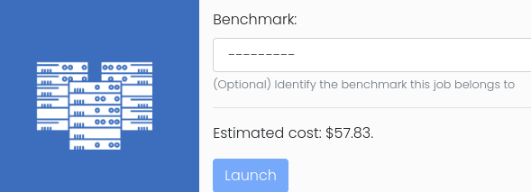

# HPC Toolkit FrontEnd - User Guide

This document is for ordinary users of the HPC Toolkit FrontEnd. Ordinary user can access HPC clusters and installed applications as set up by the administrators. They can prepare, submit and run jobs on the cluster through the convenience of the web interface. Administrators should refer to the [Administrator's Guide](admin_guide.md) for guidance on how to provision and manage cloud resources for HPC clusters.

## Access to the system

An administrator should have arranged access to the system for an ordinary user:

- A URL should be provided on which an instance of the HPC Toolkit FrontEnd is deployed.
- The Google identity of the user should be whitelisted to access the instane.
- The user should be set as authorised users on existing HPC clusters.
- Administrators can optionally set up quotas to restrict the amount of resources that can be consumed by individual users.

Discuss requirements with the admin user in your organisation:

- Applications may require certain instance types to run efficiently on GCP. Administrators may be able to create new Slurm partitions to support new instance types.
- Some applications may requite additional configurations at install time e.g. to switch on optional features. Administrators can provide binaries for additional application versions/variants.

On first visit, click the *Login* link on the home page, then click the *Login with Google* link. The system will then attempt the authenticate the user through OAuth with Google.

## Clusters

Shown on the cluster page is a list of active clusters the current user is authorised to use. Clusters are created and managed by admin users so messages on these pages are for information only. The underlying infrastructures, such as network and storage components, are also managed by admin users so those pages are not accessible by ordinary users.

## Applications

Shown on the application page is a list of pre-installed applications on authorised clusters. Applications are set up by admin users so messages on these pages are for information only. Application detail pages provide extra information regarding the pacakges.

There are three types of applications:

- those installed via the [Spack](https://github.com/spack/spack) package manager.
- those installed from custom scripts as prepared by the admin users.
- those manually installed on the clusters by admin users and then registered with this system.

Most open-source applications are covered by Spack. For in-house applications or those not yet supported by Spack, custom installtion is often a good option. Alternatively, admin users can manually install applications on shared filesystems and register them to the system by providing installation paths and load commands (e.g. modulefiles). In practice, end users do not need to distinguish these different types as they have access to a unified web interface to automate job creatation and submission.

## Jobs

From an application page, click the *New Job* action to set up a job.

In most cases, users do not need to concern about the application's software environment as the system handles that automatically. For example, if an application has been set up as a Spack package, the system will automatically invoke `spack load` to configure its environment, e.g. putting the application binaries in `$PATH`.

On the other hand, users need to provide the exact steps setting up jobs through scripts. A run script can either be located at a URL or provided inline in the job creation form. A run script may provide additional steps that download and/or prepare input files before invoking the application binary. It may also perform post-processing tasks as required.

### Job input and output

There are several different ways to prepare job input and process job output files

#### Using cloud storage

When submitting a new job, the end user may optionally specify:

- an URL from which input files are downloaded - http:// or https:// URL for an external storage, or a gs:// URL a Google cloud storage bucket.
- an gs:// URL to which output files are uploaded.

The system supports using Google Cloud Storage (GCS) buckets as external storage. Here the GCS bucket is a personal one belonging to the end user (for admin users this is not to be confused with the GCS bucket that supports the deployment of this system). A one-time set-up for the GCS bucket is required per cluster: from the *Actions* menu of a cluster, click *Authenticate to Google Cloud Storage* and then follow Google's instructions to complete the authentication.

#### Building logic directly in run script

Users can prepare the input data directly within the run script by using arbitrary scripting. Simple tasks may be performed in this way, e.g., downloading a public dataset from GitHub, or copying files already on the shared filesytem to the working directory.

#### Preparing data manually

It is also possible to prepare job data manually on the cluster. Users can always SSH into cluster login node and run arbitrary commands to prepare data in their home directories. Then job run scripts can access these files as needed.

Manually preparing data is probably the most tedious. However, it can be most cost-effective if a large amount of data is to be transmitted over the Internet, or the data is to be shared by multiple job runs. Moving large datasets from inside the run script can add significant cloud spending as all compute nodes reserved for jobs are being charged.

## Benchmarks

A benchmark is effectively a collection of jobs using the same application on the same dataset. The application version and input dataset should always be the same; the compiler/libraries to build the application and the cloud instance types to run the application can differ, so that most performant or cost-efficient ways running the jobs can be established through benchmarks.

New benchmarks can be created by an admin user from the Benchmarks section of the website.

For ordinary users, when running a job, there is an option to associated that job to an existing benchmark, as show in the following figure.



For benchmark jobs, the job script should contain logic to produce a key performance indicator (KPI) which will be sent back to the service machine and stored in the database. Job script should extract appropriate information from the job output, and use suitable scripting to
create a file called `kpi.json` and place it in the current working directory. The JSON file should be in the following format:

```json
{
  "result_unit": "some unit",
  "result_value": "some value"
}
```

## Vertex AI workbenches

Vertex AI Workbenches give the user a dedicated interactive environment to perform pre or post processing of data from the cluster. Using the frontend one can create Vertex AI workbenches dedicated to the selected user. Filestore filesystems and storage from the cluster headnode can be mounted within the Workbench and accessed as the selected user.

### Create a workbench

From the workbench menu select the option `Add workbench`. You will then be asked to select the appropriate cloud credential. Normal users and admin users are able to create workbenches however viewer users will need to request a workbench is created by their administrator.


On the above page you will be asked to select name, subnet, cloud zone, Trusted User, Machine Type, Boot disk type, Boot Disk Capacity and image family.
- Name - The given name acts as a human readable id on the frontend
- Subnet - The Subnet field determines which network the Workbench will be located in, the available subnets will be populated by the networks added to the frontend under the networks menu
- Cloud zone - The cloud zone field will be populated once the subnet is selected and will govern which zone within the region the workbench will located in.
- Trusted User - The trusted user field sets which user owns and has access to the workbench. This is the user that will be used within the workbench to access any mounted shared file storage
- Machine Type - As a normal user you will be presented with a selection of pre-approved machine types. If you require a machine type not on this list you will need to request an administrator adds this machine type to the presets or the admin user will have access to create workbenches outside of these pre-approved machine types
- Boot disk type - The type of disk storage used for the workbench boot disk
- Boot disk capacity - The amount of disk storage used for the workbench boot disk
- Image family - Currently the HPC Toolkit Frontend supports Base Python3, Tensorflow, PyTorch and R images

### Add storage

The second part of the configuration is to add any desired shared file storage. Once the initial configuration is saved an additional configuration section will be displayed showing the options to mount any shared file storage known about by the HPC Toolkit Frontend.


From this menu you will select the file storage you wish to mount, the order in which to mount and the mount point within the filesystem. It is important to remember that these filesystems can only be mounted if they are operational at the time the workbench is started.

Within the workbench there are methods for accessing GCP cloud storage (via the gsutil command) and git.

### Access workbench

Once the workbench is is configured you will be presented with the details page, which will contain a create link to start the workbench.


Once the create button is pressed the frontend will initiate the creation of the new workbench. It will take a few minutes for the workbench to be available, during which time the status will show "Workbench is being created".


Once ready an `Open JupyterLab` link will be displayed.


Click the `open JupyterLab` button, the notebook will be shown in a separate page. This is exactly the same view as notebooks opened from GCP console.


### Destroy workbench

If the workbench is no longer required it can be deleted via the destroy link on the workbench page.


It is important to remember that all data stored on the workbench instance will be deleted unless it has been saved in another place such as a shared filesystem or transferred elsewhere in another way. Once the destory button is clicked a confirmation page will be displayed.


You will then be returned to the workbench detail page with the status updated to "terminating".


Once the workbench is destroyed the workbench can either be deleted perminently or recreated if it is required again.


