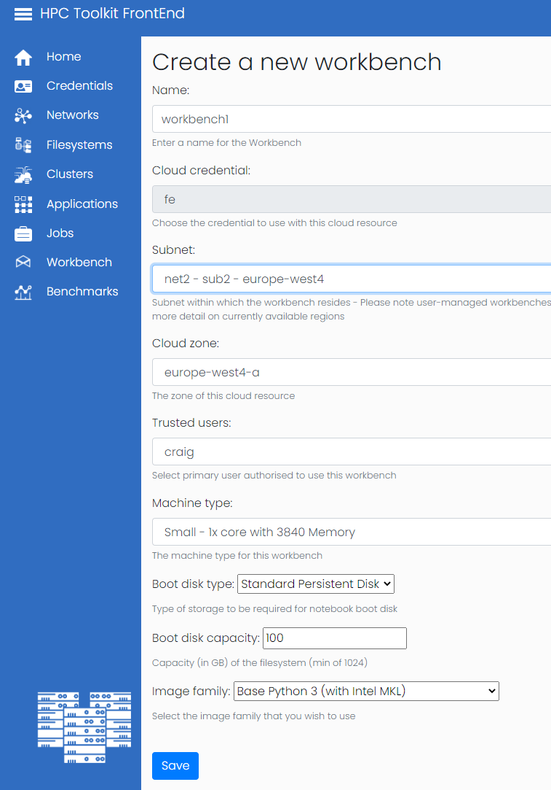
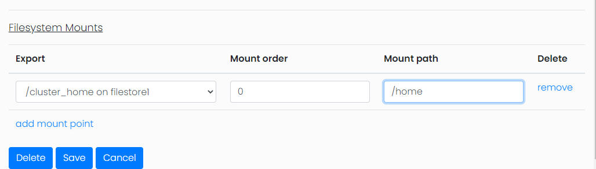
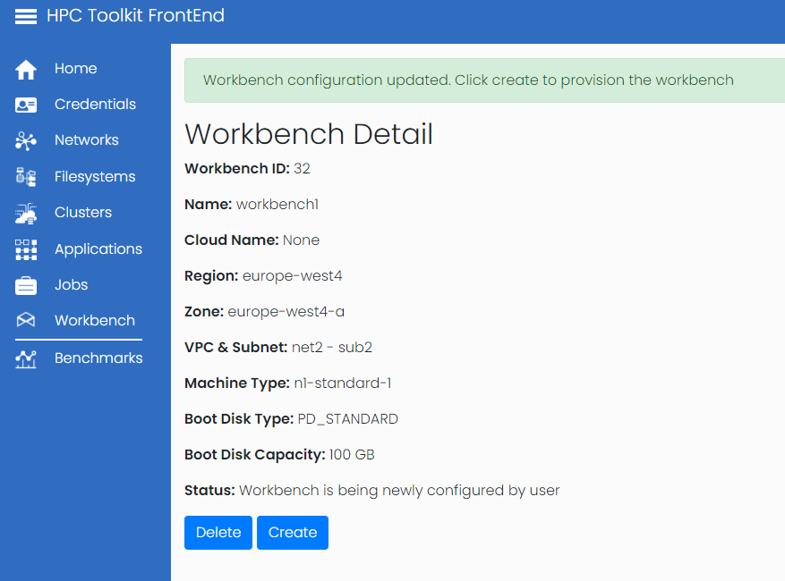
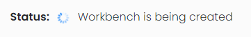
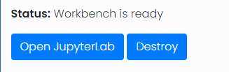
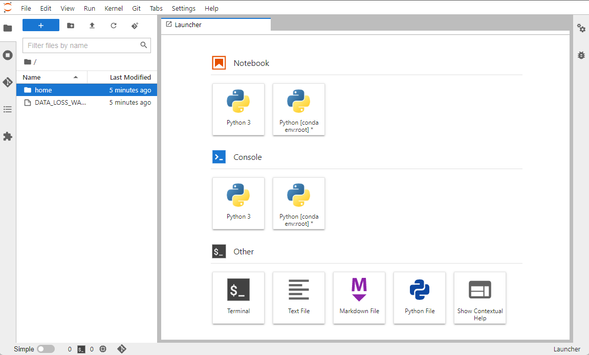
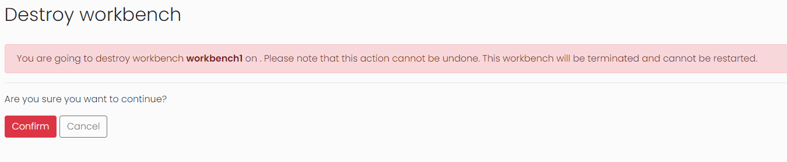
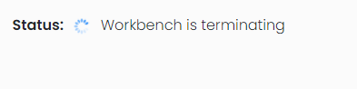
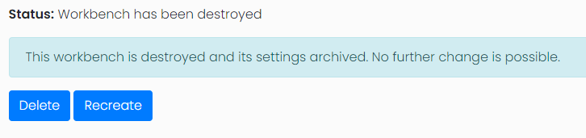

# HPC Toolkit FrontEnd - Workbench User Guide
<!--
0        1         2         3         4         5         6         7        8
1234567890123456789012345678901234567890123456789012345678901234567890234567890
-->

Vertex AI Workbenches give the user a dedicated interactive environment to
perform pre- or post- processing of data from the cluster. Using the FrontEnd
one can create Vertex AI workbenches dedicated to the selected user. Filestore
filesystems and storage from the cluster headnode can be mounted within the
Workbench and accessed as the selected user.

## Create a workbench

From the workbench menu select the option `Add workbench`. You will then be
asked to select the appropriate cloud credential. Normal users and admin users
are able to create workbenches however viewer users will need to request a
workbench is created by their administrator.

On the above page you will be asked to select name, subnet, cloud zone, Trusted
User, Machine Type, Boot disk type, Boot Disk Capacity and image family.

- Name - The given name acts as a human readable id on the FrontEnd
- Subnet - The Subnet field determines which network the Workbench will be
  located in, the available subnets will be populated by the networks added to
  the FrontEnd under the networks menu
- Cloud zone - The cloud zone field will be populated once the subnet is
  selected and will govern which zone within the region the workbench will
  located in.
- Trusted User - The trusted user field sets which user owns and has access to
  the workbench. This is the user that will be used within the workbench to
  access any mounted shared file storage
- Machine Type - As a normal user you will be presented with a selection of
  pre-approved machine types. If you require a machine type not on this list
  you will need to request an administrator adds this machine type to the
  presets or the admin user will have access to create workbenches outside of
  these pre-approved machine types
- Boot disk type - The type of disk storage used for the workbench boot disk
- Boot disk capacity - The amount of disk storage used for the workbench boot
  disk
- Image family - Currently the HPC Toolkit FrontEnd supports Base Python3,
  Tensorflow, PyTorch and R images

## Add storage

The second part of the configuration is to add any desired shared file storage.
Once the initial configuration is saved an additional configuration section
will be displayed showing the options to mount any shared file storage known
about by the HPC Toolkit FrontEnd.

From this menu you will select the file storage you wish to mount, the order in
which to mount and the mount point within the filesystem. It is important to
remember that these filesystems can only be mounted if they are operational at
the time the workbench is started.

Within the workbench there are methods for accessing GCP cloud storage (via the
`gsutil` command) and `git`.

## Access workbench

Once the workbench is is configured you will be presented with the details
page, which will contain a create link to start the workbench.

Once the create button is pressed the frontend will initiate the creation of
the new workbench. It will take a few minutes for the workbench to be
available, during which time the status will show "Workbench is being created".

Once ready an `Open JupyterLab` link will be displayed.

Click the `open JupyterLab` button, the notebook will be shown in a separate
page. This is exactly the same view as notebooks opened from GCP console.

## Destroy workbench

If the workbench is no longer required it can be deleted via the destroy link
on the workbench page.

It is important to remember that all data stored on the workbench instance will
be deleted unless it has been saved in another place such as a shared
filesystem or transferred elsewhere in another way. Once the destroy button is
clicked a confirmation page will be displayed.

You will then be returned to the workbench detail page with the status updated
to "terminating".

Once the workbench is destroyed the workbench can either be deleted permanently
or recreated if it is required again.

