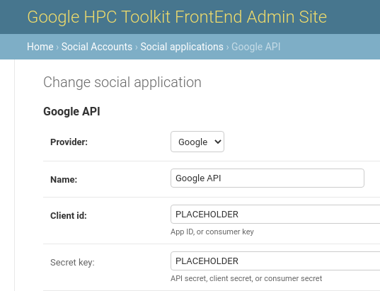

# HPC Toolkit FrontEnd - Administrator’s Guide

<!--
0        1         2         3         4         5         6         7        8
1234567890123456789012345678901234567890123456789012345678901234567890234567890
-->

This document is for administrators of the HPC Toolkit FrontEnd (TKFE). An
administrator can deploy the TKFE portal, manage the lifecycle of HPC clusters,
set up networking and storage resources that support clusters, install
applications. and manage user access. Normal HPC users should refer to the
[User Guide](user_guide.md) for guidance on how to prepare and run jobs on
clusters that have been set up by administrators.

Basic administrator knowledge of the Google Cloud Platform is needed in order to
create projects and user accounts, but all other low-level administration tasks
are handled by the portal.

TKFE is a web application built upon the Django framework.  By default, a
single Django superuser is created at deployment time - this superuser then has
administrator privileges in TKFE.  For large organisations that need additional
administrators, additional Django superusers can be created from the Admin site
within TKFE, once it is deployed and running.

The TFKE web application server uses the
[Cloud HPC Toolkit](https://github.com/GoogleCloudPlatform/hpc-toolkit) to
provision resources for networks, filesystems and clusters, using a service
account that has its credentials registered to TKFE. The service account is
used for access management and billing.

This guide covers the deployment of TKFE, registering the service account, and
the steps required to then create and manage clusters.  Further guides cover
installation of [Applications](Applications.md) and the
[Workbench](WorkbenchAdmin.md) Jupyter Notebook feature.
An [Advanced Administrators Guide](AdvancedAdmin.md) also covers features for
customising the TKFE deployment.

## TKFE Deployment

TKFE is deployed from a client machine using a script. The script will guide
the admin through the setup process, prompting for input of required
parameters, then deploy TKFE into the Google Cloud Platform.

TKFE can also be deployed using a configuration file specified with the --config option. In this case, the script will read the required parameters from the YAML file instead of prompting the user for input. This allows for more streamlined and automated deployment processes. However, it is important to ensure that all required parameters are properly specified in the configuration file before deploying.

### Prerequisites

#### Client Machine

The client machine must run Linux (or equivalent such as
[WSL](https://docs.microsoft.com/en-us/windows/wsl/install)) and there are a
small number of prerequisites that must be installed ahead of time:

- bash shell
- [Git](https://github.com/git-guides/install-git)
- [Terraform CLI](https://www.terraform.io/downloads) installation
- [Google Cloud CLI](https://cloud.google.com/cli) installation (`gcloud`
  and `gsutil` utilities)
  
#### Download TKFE

If not already downloaded, the TKFE repository needs to be cloned to the client
machine.

Clone the repository, checkout the corresponding branch, and switch to
the `frontend` directory as follows:

```bash
git clone https://github.com/GoogleCloudPlatform/hpc-toolkit.git
cd hpc-toolkit
cd community/frontend/ofe
```

All further deployment actions must be performed from this directory.

#### Google Cloud Platform

Your organisation must already have access to the Google Cloud Platform (GCP)
and be able to create projects and users.  A project and a user account with
enabled APIs and roles/permissions need to be created. The user account must
also be authenticated on the client machine to allow it to provision GCP
resources.

##### GCP project

A GCP project is required with the following APIs enabled:

```Text
 Compute Engine API
 Cloud Monitoring API
 Cloud Logging API
 Cloud Pub/Sub API
 Cloud Resource Manager
 Identity and Access Management (IAM) API
 Cloud OS Login API
 Cloud Filestore API
 Cloud Billing API
 Vertex AI API
```

If these are not enabled, the deployment script will ask to enable them for
you. It's not possible to complete a deployment without these APIs, so the
script will abort if not selected.

##### GCP user

A GCP user that is a member of the project will be able to deploy TKFE, but
must have appropriate privileges.  A user that is an *Owner* of the project
will automatically have all required roles and permissions.  Alternatively,
another account with access to the project, but a limited set of roles can be
used, which can help satisfy security concerns. The `gcloud` command can be
used to [switch to another account](https://cloud.google.com/sdk/gcloud/reference/auth/login)
and apply IAM roles.  IAM roles can also be applied via the GCP Console. The
required roles are:

```Text
 Compute Admin
 Storage Admin
 Pub/Sub Admin
 Create Service Accounts
 Delete Service Accounts
 Service Account User
 Project IAM Admin
```

If required, an even stricter, or least-privilege custom role can be created -
please refer to the [Advanced Admin Guide](AdvancedAdmin.md#Custom-roles/permissions-and-APIs).

The user account must also be [authenticated to deploy GCP resources](https://cloud.google.com/sdk/gcloud/reference/auth/application-default/login).
This can be done with the following command:

```bash
gcloud auth application-default login --project=<PROJECT_ID>
```

You will be prompted to open your web browser to authenticate.

If further help is needed, please refer to GCP documentation for:

- [Creating and managing projects](https://cloud.google.com/resource-manager/docs/creating-managing-projects)
- [Enabling APIs](https://cloud.google.com/endpoints/docs/openapi/enable-api)
- [Granting and roles/permissions](https://cloud.google.com/iam/docs/creating-custom-roles)

### Deployment Process
#### Manual deployment process

TKFE uses a deployment script run on the client machine, prompting for required
parameters, to configure TKFE.

1. Run `./deploy.sh`
1. Follow prompts to name the FrontEnd VM instance, specify the GCP project,
   zone and subnet (subnet is optional, and one will be created if required).
   The hosting VM will be referred to as the *service machine* from now on.
1. Follow prompts to enter domain name (DNS hostname) and IP address for the
   service machine.
   - For a production deployment, provide a domain name and static IP
     address.  If a static IP is needed, follow the on-screen instructions. An
     SSL certificate will automatically be obtained via
     [LetsEncrypt](https://letsencrypt.org/) to secure the web application.
   - For dev and testing purposes, the domain name and static IP address and
     domain name can be left blank. The system can still be successfully
     deployed and run with an ephemeral IP address, however OAuth2-based login
     (see later) will not be available as this requires a publicly resolvable
     domain name.
1. Follow instructions to provide details for an Admin (the Django superuser)
   account - username, password, email address.
1. Confirm whether to create a service account for managing clusters.  This
   will create a service account, and generate a credential, associated with
   the GCP project specified earlier being used to deploy TKFE.  This service
   account may not be needed if using an existing one, or using multiple
   projects (see [advanced admin guide](AdvancedAdmin.md) for details).
   - If selected, a credential file, `credential.json`. will be created in the
     directory that needs to be registered in the FrontEnd (see below).
1. Confirm the parameters are correct when prompted and the deployment can
   proceed.
   - If confirmed, the VM instance will be created.  This can take a few
     minutes.
   - **Note: after the deploy script has completed, it will still take up to
     another 15 minutes to fully install the TKFE server with its full
     software stack.**

#### Automated deployment process
TKFE can also be deployed automatically using a YAML configuration file with all the required parameters. To deploy using this option, run ./deploy.sh --config <path-to-config-file>. All required parameters for deployment must be specified in the YAML file. If any required parameter is missing or invalid, the script will exit with an error. If all parameters are provided correctly, the deployment process will proceed automatically without any prompts for user input. Note that in case of any errors during deployment, the script will exit with an error and no resources will be created or modified.

If the DJANGO_SUPERUSER_PASSWORD environment variable is set, the script will use it to set the Django superuser password instead of the value in the YAML file. This is a more secure way of handling passwords.

To use this configuration file for automated deployment, follow these steps:

1. Create a file called config.yaml.

  ```yaml
  deployment_name: MyDeployment
  project_id: my-project-id
  zone: us-west1-a
  subnet_name: my-subnet # (optional)
  dns_hostname: myhostname.com # (optional)
  ip_address: 1.2.3.4 # (optional)
  django_superuser_username: sysadm
  django_superuser_password: Passw0rd! # (optional if DJANGO_SUPERUSER_PASSWORD is passed)
  django_superuser_email: sysadmin@example.com
  deployment_mode: git # (optional)
  repo_fork: GoogleCloudPlatform # (optional)
  repo_branch: develop # (optional)
  ```

 1. Save the file in the same directory as the deploy.sh script.
 1. Open a terminal and navigate to the directory where the files are located.
 1. Run the following command: ./deploy.sh --config config.yaml
 1. The script will read the parameters from the config file and proceed with the deployment process. If DJANGO_SUPERUSER_PASSWORD environment variable is set, the script will use it to set the Django superuser password instead of the value in the YAML file.

<!--
TODO:  Give instruction for a custom deployment.

If a custom TKFE deployment is needed, the final step can be cancelled  Then
hack any files in ./tf and manually run `terraform apply` in the `frontend/tf` directory after properly setting the `terraform.tfvars`.
-->

**Important: To ensure that the TKFE resources can be fully cleaned up at a
later date, ensure that the directory containing the terraform configuration
(`./tf`) is retained.**

The deployment is now complete and after ~15 minutes, it will be possible to
log into the TKFE using the Admin account details given, at the specified
domain name or IP address via a web browser.  The IP address will be output as
`server_ip`.

---

## Post-deployment Configuration

### Credential Management

To allow TKFE to manage cloud resources on behalf of users, a
[service account](https://cloud.google.com/iam/docs/service-accounts)
must be registered by the Admin.  This is done by entering a credential
corresponding to the service account - the credential will be a json format
key file that needs to be copied into the *Credentials* form in TKFE.

The deploy script will usually create a service account and credential (unless
told not to), but other service accounts can be used -see advanced admin guide(AdvancedAdmin.md#service-account-management) for details.

<!--
The supplied credential will be validated and stored in the database for
future use.

Typically, the Owner or Editor of a GCP project have enough permissions. For
other users with custom roles, if certain permissions are missing, GCP will
typically return clear error messages.

For this project, the following roles should be sufficient for the admin users to manage the required service account: *Service Account User*, *Service Account Admin*, and *Service Account Key Admin*.
-->

## Network Management

All cloud systems begin with defining the network that components will
exist in. Before a cluster or stand-alone filesystem can be created, the
administrator must create the virtual private cloud (VPC) network. This is
accomplished under the *Networks* main menu item. Note that network resources
have their own life cycles and are managed independently.

### Create a new VPC
To create a new network, the admin must first select which credential should be
used for this network, then give the VPC a name, and then select the cloud
region for the network.

Upon clicking the *Save* button, the network is not immediately created. The
admin has to click *Edit Subnet* to create at least one subnet in the VPC.
Once the network and subnet(s) are defined, click the ‘Apply Cloud Changes’
button to trigger creation of the VPC and subnet(s).

<!-- Behind the scenes, ghpc is used to get Terraform to provision the cloud resources. -->

### Import an existing VPC

If your organisation already has predefined VPCs within the hosting GCP
project, they can be imported.  Simply select an existing VPC and associated
subnets from the web interface to register them with TKFE.  Imported VPCs
can be used in exactly the same way as newly created ones.

## Filesystem Management

By default each cluster creates two shared filesystems: one at `/opt/cluster` to
hold installed applications and one at `/home` to hold job files for individual
users. Both can be customised if required. Optionally, additional filesystems
may be created and mounted to the clusters. Note that filesystem resources have
their own life cycles and are managed independently, so they persist until
explicitly deleted and can be attached to several clusters in the same subnet.

### Create new filesystems

Currently, only GCP Filestore is supported. GCP Filestore can be created from
the *Filesystems* main menu item. A new Filestore has to be associated with an
existing VPC and placed in a cloud zone. All performance tiers are supported.

### Import existing filesystems

Existing filesystems can be registered to this system and subsequently mounted
by clusters. These can be existing NFS servers (like Filestore), or other
filesystems for which Linux has built-in mount support. For this to work, for
each NFS server, provide an IP address and an export name. The IP address must
be reachable by the VPC subnets intended to be used for clusters.

An internal address can be used if the cluster shares the same VPC with the
imported filesystem. Alternatively, system administrators can set up hybrid
connectivity (such as extablishing network peering) before mounting the
external filesystem located elsewhere on GCP.

## Cluster Management

HPC clusters can be created after setting up the hosting VPC and any
additional filesystems. The HPC Toolkit FrontEnd can manage the whole life
cycles of clusters. Click the *Clusters* item in the main menu to list all
existing clusters.

### Cluster Status
Clusters can be in different states and their *Actions* menus adapt to this
information to show different actions:

- `n` – Cluster is being newly configured by user. At this stage, a new
  cluster is being set up by an administrator. Only a database record exists,
  and no cloud resource has been created yet. User is free to edit this cluster:
  rename it, re-configure its associated network and storage components, and add
  authorized users. Click *Start* from the cluster detail page to actually
  provision the cluster on GCP.
- `c` – Cluster is being created. This is a state when the backend
  Terraform scripts is being invoked to commission the cloud resources for the
  Cluster. This transient stage typically lasts for a few minutes.
- `i` – Cluster is being initialised. This is a state when the cluster
  hardware is already online, and Ansible playbooks are being executed to
  install and configure the software environment of the Slurm controller and
  login nodes. This transient stage can last for up to 15 minutes.
- `r` – Cluster is ready for jobs. The cluster is now ready to use.
  Applications can be installed and jobs can run on it. A Slurm job scheduler is
  running on the controller node to orchestrate job activities.
- `t` – Cluster is terminating. This is a transient state after Terraform
  is being invoked to destroy the cluster. This stage can take a few minutes
  when Terraform is working with the cloud platform to decommission cloud
  resources.
- `d` – Cluster has been destroyed. When destroyed, a cluster cannot be
  brought back online. Only the relevant database record remains for information
  archival purposes.

A visual indication is shown on the website for the cluster being in creating,
initialising or destroying states. Also, relevant web pages will refresh every
15 seconds to pick status changes.

### Create a new cluster

A typical workflow for creating a new cluster is as follows:

1. At the bottom of the cluster list page, click the *Add cluster* button to
   start creating a new cluster. In the next form, choose a cloud credential.
   This is the Google Service Account which will create the cloud resources.
   Click the *Next* button to go to a second form from which details of the
   cluster can be specified.
1. In the *Create a new cluster* form, give the new cluster a name. Cloud
   resource names are subject to naming constraints and will be validated by the
   system.  In general, lower-case alphanumeric names with hyphens are
   accepted.
1. From the *Subnet* dropdown list, select the subnet within which the cluster
   resides.
1. From the *Cloud zone* dropdown list, select a zone.
1. From the *Authorised users* list, select users that are allowed to use this
   cluster.
1. Click the *Save* button to store the cluster settings in the database.
   Continue from the *Cluster Detail* page.
1. Click the *Edit* button to make additional changes. such as creating more
   Slurm partitions for different compute node instance types, or mounting
   additional filesystems.
   - For filesystems, note the two existing shared filesystems defined by
     default. Additional ones can be mounted if they have been created earlier.
     Note the *Mounting order* parameter only matters if the *Mount path*
     parameter has dependencies.
   - For cluster partitions, note that one *c2-standard-60* partition is
     defined by default. Additional partitions can be added, supporting
     different instance types. Enable or disable hyperthreading and node reuse
     as appropriate. Also, placement group can be enabled (for C2 and C2D
     partitions only). In the *image* field one can optionally supply a custom
     image to be used by the compute nodes. Administrators should ensure such
     an image is compatible to the CentOS 7 based machine image used by Slurm
     GCP. Otherwise additional customisation done by this system might fail.
1. Finally, save the configurations and click the *Create* button to trigger
   the cluster creation.

### Deleting a cluster

To destroy a cluster, first find the list of clusters in the *Clusters* menu,
then simply select *Destroy* pop-down *Actions* menu and confirm.
Any jobs still running on the Cluster will be automatically killed.

## User Management

### SSH access to the service machine

SSH access to the service machine is possible for administration purposes.
Administrators can choose from one of the following options:

- [SSH directly from the GCP console](https://cloud.google.com/compute/docs/instances/connecting-to-instance).
- [Add their public SSH key to the VM instance after deployment via GCP console](https://cloud.google.com/compute/docs/connect/add-ssh-keys#add_ssh_keys_to_instance_metadata).
- [Add their SSH key to the GCP project to use on all VMs within the project](https://cloud.google.com/compute/docs/connect/add-ssh-keys#add_ssh_keys_to_project_metadata).

*N.B The service machine is not, by default, configured to use the os-login service.*

### Set up Google OAuth2 login

While it is possible to use a Django user account to access the FrontEnd
website, and indeed doing so is required for some administration tasks, standard
users must authenticate using their Google identities via Google OAuth2.  This,
combined with the use of Google OSLogin for access to clusters, ensures
consistent Linux identities across VM instances that form the clusters. Web
frontend login is made possible by the *django-allauth* social login extension.

For a working  deployment, a fully-qualified domain name must be obtained and
attached to the website as configured in the deployment script.  Next, register
the site with the hosting GCP project on the GCP console in the *Credentials*
section under *APIs and services* category. Note that the *Authorised JavaScript
origins* field should contain a callback URL in the following format:
`https://<domain_name>/accounts/google/login/callback/`


From the GCP console, note the client ID and client secret. Then return to admin
site of the deployment, locate the *social applications* database table. A
'Google API' record should have been created during the deployment. Replace the
two placeholders with the client ID and client secret. The site is ready to
accept Google login.



#### Set Allowed Users by Email Address

Next, go to the *Authorised user* table. This is where further access control
to the site is applied. Create new entries to grant access to users. A new
entry can be:

- a valid domain name to grant access to multiple users from authorised
organisations (e.g. *@example.com*)
- an email address to grant access to an individual user (e.g
*user.name@example.com*)

All login attempts that do not match these patterns will be rejected.

#### Note on external users

If you wish to allow users from outside your Google Cloud organization to use
the cluster you will need to additionally assign these users the
`roles/compute.osLoginExternalUser` role at an Organization level (there is no
way to assign at the project level).

User accounts will be automatically created for users when they log into the
FrontEnd for the first time, by default new accounts are created with quota
disabled.  To enable job submission for an account, administrators must enable
compute quota from the *Users* page.

### User Compute Quota

Currently three quota modes are supported:

- **Unlimited quota** - User may submit an unlimited number of jobs
- **Limited quota** - User may submit jobs up to a total spend limit in USD
- **Quota Disabled** - User may not submit jobs - this is the default for newly created accounts

When **limited quota** is selected, an additional field **quota amount** will be available to set the total spend available to the user.

## Application Management

Please see the [application installation guide](Applications.md).

## Workbench Management

Please see the [Workbench Admin Guide](WorkbenchAdmin.md).

## Teardown Process

The TKFE package contains a `teardown.sh` script that will destroy the running
FrontEnd instance. This script only removes the FrontEnd, not resources started from it.

**Before running the teardown script, ensure that all clusters, VPCs,
workbenches and filestores are removed using the TKFE web interface before
destroying it. These resources will otherwise persist and accrue costs.**

To tear down the web interface and its hosting infrastructure, run
directory `./teardown.sh` on the original client machine
in the same directory that was used to deploy TKFE.

Note: If the -y flag is passed to the script, all user questions will be answered with "yes". This is intended for automated deployments where user input is not possible.

## Troubleshooting

### Finding Log Files

The service machine produces log files in `/opt/gcluster/run/`. These log
files will show errors from the Django web application.

Cloud resource deployment log files (from Terraform) are typically shown via
the FrontEnd web site.  If those logs are not being shown, they can be found on
the service machine under
`/opt/gcluster/hpc-toolkit/frontend/(clusters|fs|vpc)/...`.
HPC Toolkit log files will also be found in those directories.  The Terraform
log files and status files will be down a few directories, based off of the
Cluster Number, Deployment ID, and Terraform directory.

On Cluster controllers, most of the useful log files for debugging can be
retrieved by executing the 'Sync Cluster' command.  These include Slurm log
files as well as general system log files.  The daemon which communicates to
the service machine logs to syslog, and can be viewed on the cluster controller
node via `journalctl`, looking at the `ghpcfe_c2` service.

Job logs and Spack application logs are uploaded upon job completion to Google
Cloud Storage and viewable via the HPC Frontend.

### Deployment problems

Most deployment problems are caused by not having the right permissions. If
this is the case, error message will normally show what permissions are
missing. Use the [IAM permissions reference](https://cloud.google.com/iam/docs/permissions-reference)
to research this and identify additional roles to add to your user account.

Before any attempt to redeploy the TKFE, make sure to run
`terraform destroy` in `hpc-toolkit/frontend/tf` to remove cloud resources that
have been already created.

### Cluster problems

The FrontEnd should be quite reliable provisioning clusters. However, in cloud
computing, errors will and do happen from time to time; usually due to changes
in back-end services or other factors beyond scope of the TKFE. For example, a
resource creation could fail because the hosting GCP project has ran out of
certain resource quotas; or an upgrade of an underlying machine image might
have introduced changes that are incompatible to the TKFE, which then needs
updating.
It is not possible to capture all such situations.  Here, a list of tips is
given to help debug cluster creation problems. The
[Developer's Guide](developer_guide.md) contains a lot of details on how the
back-end logic is handled, which can also help with certain issues.

- If a cluster is stuck at status 'c', something is wrong with the provisioning
  of cluster hardware.
  - SSH into the service machine and identify the directory containing the
    run-time data for that cluster at `frontend/clusters/cluster_<cluster_id>`
    where `<cluster_id>` can be found on the web interface. Check the
    Terraform log files there for debugging information.
- If a cluster is stuck at status 'i', hardware resources should have been
  commissioned properly and there is something wrong in the software
  configuration stage.
  - Locate the IP address of the Slurm controller node and find its VM
    instance on GCP console. Check its related *Serial port* for system log.
  - If needed, SSH into the controller from the GCP console to check Slurm
    logs under `/var/log/slurm/`.

### General clean-up tips

- If a cluster is stuck in 'i' state, it is normally OK to find the *Destroy*
  button from its *Actions* menu to destroy it.
- For failed network/filesystem/cluster creations, one may need to SSH into the
  service machine, locate the run-time data directory, and manually run
  `terraform destroy` there for clean up cloud resources.
- Certain database records might get corrupted and need to be removed for
  failed clusters or network/filesystem components. This can be done from the
  Django Admin site, although administrators need to exercise caution while
  modifying the raw data in Django database.
