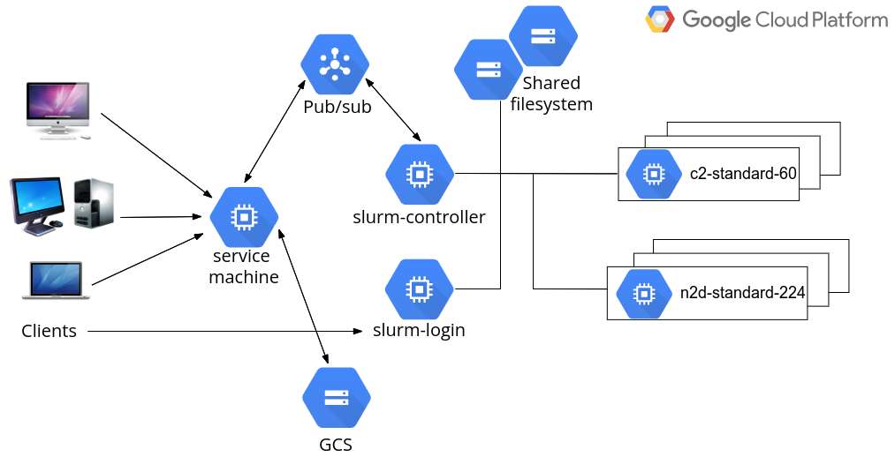
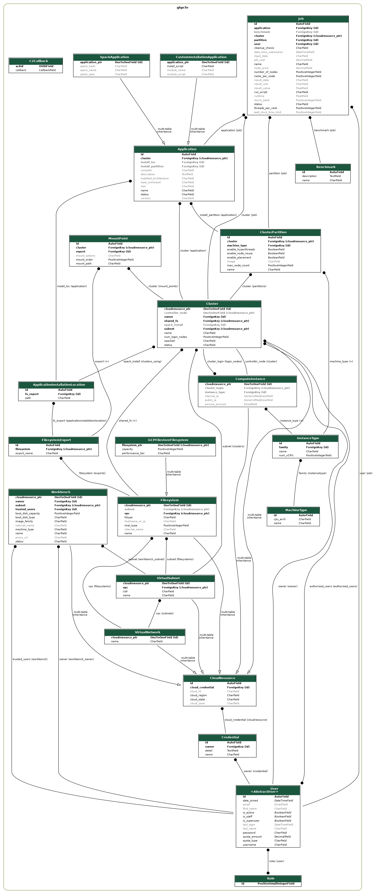

## HPC Toolkit FrontEnd - Developer Guide
<!--
0        1         2         3         4         5         6         7        8
1234567890123456789012345678901234567890123456789012345678901234567890234567890
-->
### Architecture design

The HPC Toolkit FrontEnd is a web application integrating several front-end and
back-end technologies. *Django*, a high-level Python-based web framework, forms
the foundation of the web application. The back-end business logics can mostly
be delegated to *Terraform* to create GCP cloud infrastructure required by the
HPC clusters. With HPC Toolkit, there is no need to define infrastructure
configurations from scratch. Rather, a high-level description of the clusters
are provided for it to generate Terraform configurations.

The overall system design is described in the following figure:

 <!--TODO: refine this sketch-->

In most cases, end-users are expected to use and communicate with the cloud
systems via the FrontEnd. Of course, users from a traditional supercomputing
background may wish to work with HPC clusters from the command line. This is
entirely possible through the Slurm login nodes.

<!--
In a production environment, it is typically good practice to leave the web
application behind a load balancer, which provides additional performance,
calability, and security.

This system is currently NOT capable of being run in parallel, so a Load
Balancer will not add any benefits.
-->

A single compute engine virtual machine, referred to as the **service machine**
from now on, should be created to host the application server, webserver and
database server. In large productions, these servers can of course be hosted on
different machines if desired.

The web application is built upon Django, a Python framework to develop
data-driven dynamic websites. An *nginx* server is configured to serve the
static files of the website, as well as proxying Django URLs to the application
server. ([Uvicorn](https://www.uvicorn.org) is the chosen application server).
Application data is stored in a file-based SQLite database which can be easily
replaced by a managed SQL service for large production environments.

From the web application, HPC clusters can be created on GCP by administrators.
A typical HPC cluster contains a single Slurm controller node, and one or more
login nodes, typically all running on low- to mid-range virtual machines. The
controller node hosts the Slurm job scheduler. Through the job scheduler,
compute nodes can be started or terminated as required. The controller node and
login nodes all provide public IP addresses for administrators or users to SSH
into, although doing so is not mandatory as day-to-day tasks can be performed
via the web interface.

The Slurm job scheduler supports partitions. Each partition can have compute
nodes of different instance types. All major HPC capable instance types can be
supported from a single cluster if so desired. Of course, it is also possible
to create multiple clusters, which is entirely an
operational decision by the administrators.

For each cluster, two shared filesystems are created to host a system directory
for applications and a home directory for users' job data. Additional
filesystems can be created or imported, to be mounted to the clusters.

For each deployment, a GCS bucket is created to hold supporting files,
including configurations to build the service machine, and Ansible
configurations to set up various Slurm nodes. The same GCS bucket is also
served as a long-term backup to application and job data, including log files
for most cloud operations and selected files created by jobs.

Communication between the service machine and clusters is handled by
[Pub/Sub](https://cloud.google.com/pubsub). For technical details, consult the
[Cluster Command & Control](ClusterCommandControl.md) document. Alternatively,
there is an API layer around Django to allow incoming communication to the
service machine.

### Deploy the system

Please follow the deployment section in the
[Administrator’s Guide](admin_guide.md) to deploy the system for testing and
development.

Here are some notes from a developer's perspective:

- The deployment is done using Terraform.
- When `deploy.sh` is invoked, it validates the client machine's development
  environment, collects configuration information from user, save input
  variables in `tf/terraform.tfvars`, and invoke Terraform.
  - The deploy script will check the GCP project being used has the correct
    APIs enabled.  The list of required APIs is embedded in `deploy.sh`
    script - **this will need to be maintained**.
  - The deploy script will also, optionally, use an additional script,
    `script/service_account.sh`, to create a GCP service account.  This sets
    the correct roles/permissions on the account based on a list kept in the
    script - **this will need to be maintained**.
- Terraform creates a hosting VPC and a subnetwork for the deployment, together
  with the necessary firewall rules.
- Terraform creates a supporting GCS bucket. This bucket is not only used
  during deployment, but also provides a long-term storage for clusters
  operating within this deployment.
- Terraform sets up a Pub/Sub topic for communication between the service
  machine and clusters.
- Terraform provisions a compute engine virtual machine to be the service
  machine. A startup script is then executed on the service machine to set up
  the software environment for HPC Toolkit and Django, and start the web and
  application servers.

### Access the service machine

By default, access to the service machine is restricted to authorised users
(the owner/editor of the hosting GCP project or other users delegated with
sufficient permissions). Use one of the following two methods to access the
system after a new deployment:

- SSH into the service machine directly from the GCP console of the hosting GCP
  project.
- Edit the hosting VM instance by uploading the public SSH key of a client
  machine to grant SSH access.

Immediately after login, run `sudo su -l gcluster` to become the *gcluster*
user. This user account was created during the deployment to be the owner of
the FrontEnd files.

### Directory structures on service machine

The home directory of the *gcluster* account is at `/opt/gcluster`. For a new deployment, the following four sub-directories are created:

- `go` - the development environment of the Go programming language, required to build Google HPC Toolkit
- `hpc-toolkit` - a clone of the Google HPC Toolkit project. The `ghpc` binary
   should have already been built during the deployment. The `frontend`
   sub-directory contains the Django-based web application for the FrontEnd and
   other supporting files.
- `django-env` - a Python 3 virtual environment containing everything required
   to support Django development. To activate this environment:
   `source ~/django-env/bin/activate`. Doing so may be required during the
   development, e.g., when running the Django `manage.py` script for
   administration tasks.
- `run` -  directory for run-time data, including the following log files:
  - `nginx-access.log` - web server access log.
  - `nginx-error.log` - web server error log.
  - `supvisor.log` -  Django application server log. Python `print` from
     Django source files will appear in this file for debugging purposes.
  - `django.log` - additional debugging information generated by the Python
     logging module is written here.

### Run-time data

#### For cloud resources

Run-time data to support creating and managing cloud resources are generated
and stored in the following sub-directories within `hpc-toolkit/frontend` on
the service machine:

- `clusters/cluster_\<id>` - holding run-time data for a cluster. `\<id>` here
has a one-to-one mapping to the IDs shown in the frontend's cluster list page.
The directory contains the following:
  - `cluster.yaml` - input file for `ghpc`, generated based on information
    collected from the web interface.
  - `\<cluster_name>_\<random_id>/primary` - Terraform files generated by
   `ghpc` to create the cluster, and log files from running
   `terraform init/validate/plan/apply`. Should there be a need to manually
    clean up the associated cloud resources, run `terraform destroy` here.
- `vpcs/vpc_\<id>` - similar to above but holding run-time data for a virtual
  network. Currently creating custom mode VPC is not yet supported by HPC
  Toolkit. A custom set of Terraform configurations are used.
- `fs/fs_\<id>` - similar to above but holding run-time data for a filesystem.
  Currently only GCP Filestore is supported.

Note that life cycles of VPCs and Filestores are managed independently to those
of clusters.

#### For applications

Application data is stored in the shared filesystem `/opt/cluster`. It contains the following sub-directories:

- `/opt/cluster/spack` contains a Spack v0.17.1 installation.
- When applications are installed via the web interface, supporting files are
  saved in `/opt/cluster/install/<application_id>` where `<application_id>` can
  be located from the web interface.
  - For a Spack installation, a job script `install.sh` is generated to
    submit a Slurm job to the selected partition to run `spack install` of
    the desired package.
  - For a custom installation, a job script `install_submit.sh` is generated
    to submit a Slurm job to the selected partition to execute `job.sh` which
    contains the custom installation steps.
- After each successful installation, Spack application binaries are stored at
  `/opt/cluster/spack/opt/spack/linux-centos7-<arch>` where `<arch>` is the
  architecture of the processors on which the binaries get built, such as
  `cascadelake` or `zen2`.
- Standard output and error files for Slurm jobs are stored in the working
  directories and also uploaded to the GCS bucket associated with the
  deployment at `gs://<deployment_name>-<deployment_zone>-storage/clusters/<cluster_id>/installs/<application_id>/stdout|err`
  so that they remain available even if the clusters are destroyed.

#### For jobs

Job data is stored in the shared filesystem `/home/<username>` for each user.
Here `<username>` is the OS Login username, which is generated by Google and
will be different from the user's normal UNIX name. The home directories
contain the following:

- When a job is submitted from the web interface, supporting files are saved in
  `/home/<username>/jobs/<job_id>` where `<job_id>` can be located from the web
  interface.
- When running a Spack application, a job script `submit.sh` is generated to
  submit a Slurm job. This script performs a `spack load` to set up the
  application environment and then invoke `job.sh` which contains the
  user-supplied custom commands to run the job.
- Standard output and error files for Slurm jobs are uploaded to the GCS bucket
  associated with the deployment at the following URLs:
  `gs://<deployment_name>-<deployment_zone>-storage/clusters/<cluster_id>/jobs/<job_id>/stdout|err`.

Note that a special home directory is created at `/home/root_jobs` to host jobs
submitted by the Django superusers. For convenience they do not need Google
identities and their jobs are run as *root* on the clusters.

### Django development

#### Database Design

Django is great at building data-driven applications. The major system
components, such as clusters, applications, and jobs, can easily map to Django
data models. The database design of this system is best shown with a UML
diagram. This was generated using a function available in the Python
*django-extensions* package (depending on the Python *pydotplus* package and
*graphviz* package to create the image output). To generate the UML diagram,
run from the command line:

```python
python manage.py graph_models -a -X <classes_to_exclude> -o UML_output.png
```

To simplify the output and exclude Django's internal models, append a list of
comma-separated class names after the -X flag. The result is shown below:



Note that the *CloudResource* model is at the base of all cloud resources
including network components, storage components, compute instance
(representing a single VM), clusters, and Workbenches.

#### Code Layout

The top few layers of the directory hierarchy of the HPC Toolkit FrontEnd
define the major components:

| dir                         | description |
|-----------------------------|-------------|
| `hpc-toolkit/frontend/`     | Top level   |
| `.../cli/`                  | client commandline interface |
| `.../docs/`                 | documentation |
| `.../infrastructure_files/` | Support files for deploying cloud infrastructure |
| `.../tf/`                   | Terraform files for deploying the HPC FrontEnd |
| `.../website/`              | Source code for the HPC Frontend website |

##### Infrastructure Files

| dir                         | description |
|-----------------------------|-------------|
| `.../frontend/infrastructure_files/` | Top level   |
| `.../cluster_startup/`               | Bootstrap startup scripts |
| `.../gcs_bucket/`                    | Common configuration files (scripts, Ansible) to store in GCS |
| `.../vpc_tf/`                        | Terraform templates for creating VPCs |
| `.../workbench_tf/`                  | Terraform templates for creating Workbenches |

These directories hold all the support infrastructure files which are used to
create, provision, and initialize the cloud resources which may be created via
the HPC Toolkit FrontEnd.  The VPC Terraform and Workbench Terraform files may
eventually migrate into HPC Toolkit YAML files.

The files under `gcs_bucket` contain the more in-depth startup scripts and
configuration information for the FrontEnd webserver as well as for new
clusters.  During the initial deployment of the HPC Toolkit FrontEnd, this
directory is copied to a new Google Cloud Storage bucket which is then used for
storing these startup codes as well as additional cluster information, such as
log files.  When clusters are created in Google Cloud, the initial bootstrap
template startup script (from the `cluster_startup` directory) are set to be
the instance startup script.  These scripts are responsible for downloading
from Google Cloud Storage the Ansible repository which is stored in the
`gcs_bucket/clusters/ansible_setup/`, and running Ansible to initialize the
instance.

The source-code for the cluster client-side Command & Control daemon is stored
here as well, under
`.../ansible_setup/roles/c2_daemon/files/ghpcfe_c2daemon.py`

##### Website

| dir                     | description |
|-------------------------|-------------|
| `.../frontend/website/` | Top level   |
| `.../ghpcfe/`           | Frontend Application dir |
| `....../cluster_manager/` | Utilities for cloud & backend operations |
| `....../management/`     | Extra Django setup commands |
| `....../migrations/`     | Database migration scripts |
| `....../static/`         | Images, Javascript and other static web collateral |
| `....../templates/`      | Web view templates |
| `....../views/`          | Python files for model views |
| `.../templates/`        | All-Social plugin Templates |
| `.../website/`          | Django core website configuration (including `settings.py`) |
| `.../manage.py`         | Core Django application management script |

As with many Django-based web applications, the HPC Toolkit FrontEnd Django
application is broken across multiple directories, each responsible for some
critical subcomponent of the overall application, implementing the MVT (model,
view, template) architecture.  The `ghpcfe/` directory hosts the pieces
specific to the HPC Toolkit FrontEnd, whereas the other directories are more
Django-focused.

Under `ghpcfe/`, there are a variety of directories as show in the above
table.  Directly inside this directory is the majority of the Python files
which make up the Frontend web application. Of particular interest would be
`models.py`, which stores the DB models and `forms.py`, for custom web forms.
There are a sufficiently large number of Django views in the application, so
the prototypical `views.py` is broken into its own Python package.

Also under `ghpcfe/` is the `cluster_manager` directory, which contains most of
the "backend" code responsible for gathering cloud information as well as
creating, controlling, and configuring cloud resources.  Of particular interest
here are the files:

- `c2.py`: Responsible for bidirectional communication between the FrontEnd and
  any created clusters.
- `cloud_info.py`: Provides many utilities for querying information from Google
  Cloud about instance types, pricing, VPCs and so forth
- `cluster_info.py`: Responsible for creating clusters and keeping track of
  local-to-frontend cluster metadata

Note that these "backend" functions are often invoked asynchronously if the
tasks performed are time-consuming. Support to asynchronous views were
introduced in Django v3.1.

Finally, `templates` directory contains the web view templates. Django ships
with its own template engine to process these template files and insert dynamic
contents to them.

## Workbenches Architecture

The workbench process is fairly straight-forward. Gather configuration values
from the FrontEnd and pass them to Terraform to control the creation of the
workbench instance. This is done directly via Terraform as the HPC Toolkit does
not currently support Vertex AI Workbenches.

### Infrastructure files

Workbenches are created using a template configuration in
`hpc-toolkit/frontend/infrastructure_files/workbench_tf`. The Terraform
template was originally based on the Terraform template provided by the
[Google Cloud Platform Rad-Lab git repo](https://github.com/GoogleCloudPlatform/rad-lab)
however the configuration diverged during early development. The main reason
for this divergence was to accommodate running the Jupyter notebook as a
specific OSLogin user rather than the generic Jupyter user which would make it
impossible to interact properly with any mounted shared storage.

The process of creating the workbench files is mostly contained within the file
`hpc-toolkit/frontend/website/ghpcfe/cluster_manager/workbenchinfo.py`. The
`copy_terraform()` routine copies files from the `infrastructure_files`
directory while the `prepare_terraform_vars()` routine creates a
`terraform.tfvars` file within the
`hpc-toolkit/frontend/workbenches/workbench_##` directory to provide the
following info gathered by the FrontEnd during the workbench creation process:

- region
- zone
- project_name
- subnet_name
- machine_type
- boot_disk_type
- boot_disk_size_gb
- trusted_users
- image_family
- owner_id
- wb_startup_script_name
- wb_startup_script_bucket

### Storage mount points

Storage mount points are configured on the second part of the creation process.
This is done via a Django UpdateView form at
`https://$FRONTEND.URL/workbench/update/##` with the main configuration fields
disabled as Terraform does not support modification of an existing Vertex AI
workbench, the workbench would be destroyed and recreated.

Additionally the mount points are added to the startup script and there is no
method in the frontend to re-run this startup script to mount any additional
mount points therefore the UpdateView form is only presented during the
creation process. Once information on the mount points is collected the startup
script can be generated.

### Startup script

The startup script is generated by the `copy_startup_script()` process in
`cluster_manager/workbenchinfo.py`. This process has two parts. The first part
is generated using information gathered by the frontend and passes the user's
social ID number set by the owner_id field. It also passes any configured mount
points into the startup script before the second part of the startup script is
copied from `infrastructure_files/gcs_bucket/workbench/startup_script_template.sh`.

The startup script runs the following processes when the workbench instance
boots:

- Query instance metadata for list of users and filter based on the users
  social ID number to discover the correct format of their OSLogin username.
- Install nfs-common package via `apt-get`.
- Make temporary jupyterhome directory in /tmp/ and set user ownership.
- Make home directory for the user and set user ownership.
- Copy Jupyter configuration files from `/home/jupyter/.jupyter` to
  `/tmp/jupyterhome/.jupyter`.
- Create `DATA_LOSS_WARNING.txt` file with warning message.
- Configure specified mount points in order specified on FrontEnd.
- Add symlink to `/tmp/jupyterhome/` which will serve as working directory on
  the web interface.
  - This process of mounting and symlinking means the mountpoint will appear
    in both the jupyter notebook web interface working directory and in the
    expected location in the root filesystem.
- Append mount points to `DATA_LOSS_WARNING.txt` file.
- If `/home` was not mounted as a mount point then create a symlink to
  `/home` in `/tmp/jupyterhome`.
- Modify Jupyter config to reflect username and new working directory.
- Update `/lib/systemd/system/jupyter.service` systemd service file to reflect
  username and new working directory.
- Run `systemctl` daemon-reload and restart Jupyter service.
  - Without updating the Jupyter config and restarting the service then the
    Jupyter notebook would be running as the jupyter user. This would break
    permissions used on any mounted shared storage.
