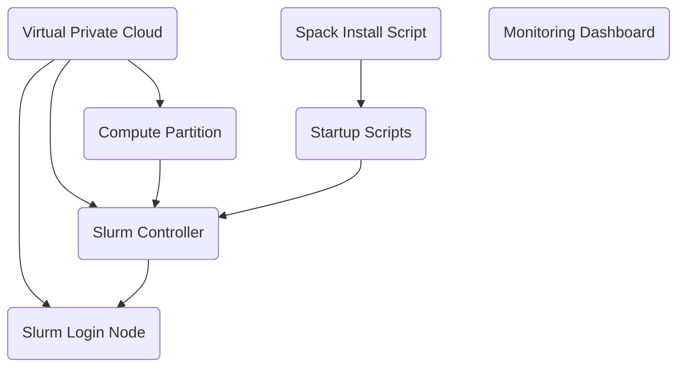

# Tutorials

## Quickstart Tutorial

Find the quickstart tutorial on
[Google Cloud docs](https://cloud.google.com/hpc-toolkit/docs/quickstarts/slurm-cluster).

## Simple Cluster Tutorial

Deploy a simple HPC cluster with the HPC Toolkit in
[cloud shell](https://cloud.google.com/shell) using the
[hpc-cluster-small.yaml](../../examples/hpc-cluster-small.yaml) example.

It is recommended to use the [Quickstart Tutorial](#quickstart-tutorial), which
covers similar material as the Simple Cluster Tutorial and will be replacing
this tutorial in the future.

Click the button below to launch the Simple Cluster Tutorial.

## Intel Select Tutorial

Walks through deploying an HPC cluster that is based on the
[HPC virtual machine (VM) image][hpc-vm-image] and complies to the
[Intel Select Solution for Simulation and Modeling criteria][intel-select].

Click the button below to launch the Intel Select tutorial.

[hpc-vm-image]: https://cloud.google.com/compute/docs/instances/create-hpc-vm
[intel-select]: https://www.intel.com/content/www/us/en/products/solutions/select-solutions/hpc/simulation-modeling.html

## HTCondor Tutorial

Walk through deploying an HTCondor pool that supports jobs running inside Docker
containers or the base [HPC VM Image][hpc-vm-image].

Click the button below to launch the HTCondor tutorial.

## Application Specific Tutorials

The following three tutorials deploy a cluster, install an hpc application
(Growmacs, Openfoam, or WRF), and walk through submitting a real workload.

By default these tutorials build the applications from source, which takes
several hours on deployment. If a complete Spack cache is provided using the
`spack_cache_mirror_url` variable, application installation can be reduced to 6
minutes.

### Gromacs

### Openfoam

### Weather Research and Forecasting (WRF) Model

### Blueprint Diagram for Application Tutorials

All the application specific tutorials above use similar blueprints built of
from a number of terraform modules. The diagram below shows how the various
modules relate to each other.

