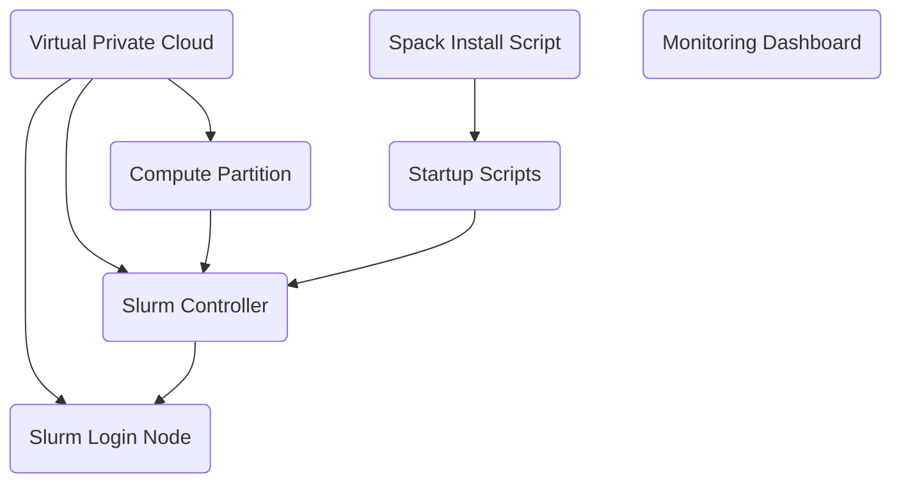

# Google Cloud HPC Toolkit - Application Demos

Click on one of the buttons below to launch a hands on tutorial.

## Gromacs

## Openfoam

## Weather Research and Forecasting (WRF) Model

## Blueprint Diagram

All the tutorials above use similar blueprints built of from a number of
terraform modules. The diagram below shows how the various modules relate to
each other.

