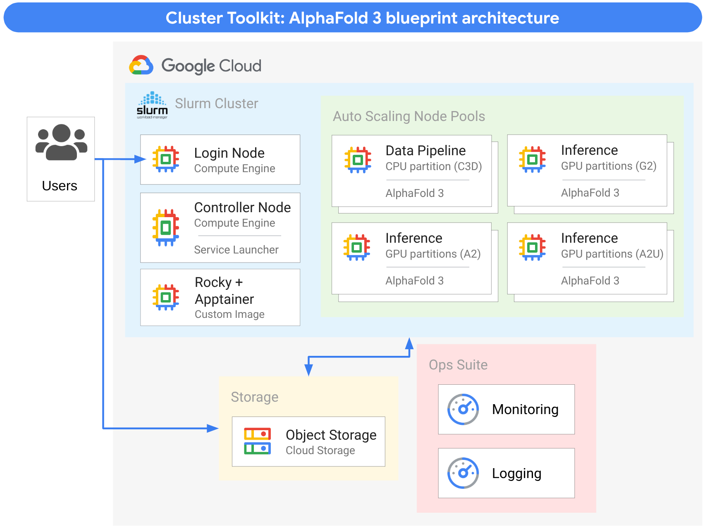

# AlphaFold 3 High Throughput Solution
Welcome to the Cluster Toolkit AlphaFold 3 High Throughput Solution!

This solution lets you create a high-throughput execution environment for Google Deepmind's
[AlphaFold 3](https://blog.google/technology/ai/google-deepmind-isomorphic-alphafold-3-ai-model)
in your own GCP project.

This solution uses the unmodified [AlphaFold 3 package](https://github.com/google-deepmind/alphafold3),
and provides a best-practices mapping of it to Google Cloud, leveraging Google Cloud's HPC technology.

Before using this solution, please review the [AlphaFold 3 Model Parameter Terms of Use](https://github.com/google-deepmind/alphafold3/blob/main/WEIGHTS_TERMS_OF_USE.md).
Please check that you/your organization are eligible for obtaining the weights and that your use falls within the allowed terms and complies
with the [Prohibited Use Policy](https://github.com/google-deepmind/alphafold3/blob/main/WEIGHTS_PROHIBITED_USE_POLICY.md).

## High Throughput - what do you mean?
AlphaFold 3 takes amino-acid sequences as inputs ([AlphaFold 3 Input](https://github.com/google-deepmind/alphafold3/blob/main/docs/input.md)) and generates multiple outputs ([AlphaFold 3 Outputs](https://github.com/google-deepmind/alphafold3/blob/main/docs/output.md), such as the structure in mmCIF format and confidence scores.

For reference, executing the AlphaFold 3 workflow end-to-end for a single sequence can
take from minutes to hours, depending on the input sequence length and the resulting number of embedding
tokens. Under the hood, the AlphaFold 3 workflow executes two distinctly different steps,
Datapipeline and Inference. Some use cases require the linear execution of the two steps, others may
execute multiple Inference runs for the same Datapipeline output.

This is where this High Throughput solution comes into play: by leveraging the Google Cluster Toolkit
this solution provisions an auto-scaling HPC environment. Using the Slurm Workload Manager, this solution
can dynamically spin up and spin down compute resources for the Datapipeline stage and Inference stage
respectively and as required by your folding workloads.



The AlphaFold 3 High Throughput solution maps the Datapipeline and Inference steps to Google Compute Engine
VM families that give you a **high number of folding executions/$** and that can horizontally scale out.
By simply increasing the number of nodes Slurm is allowed to provision in each partition, you can
**scale out to thousands of folds per day (or more)**. The auto-scaling property allows you to provision
this capacity on demand, but you can also provision it statically if you want a guaranteed throughput at
all times.

This blueprint uses the following GCP components:

- Google's [C3D-highmem VM family](https://cloud.google.com/compute/docs/general-purpose-machines#c3d_series)
- Google's [G2, A2-highgpu or A2-ultragpu VM families](https://cloud.google.com/compute/docs/accelerator-optimized-machines)
- Google Cloud Storage
- SchedMD's Slurm Workload Manager

## Choice of Default Inference GPU family
The blueprint comes preconfigured with three different inference partitions:
- infg2 - using GCP's [g2-standard family](https://cloud.google.com/compute/docs/gpus#l4-gpus) with Nvidia's L4 GPU with 24 GB of GPU memory
- infa2 - using GCP's [a2-highgpu family](https://cloud.google.com/compute/docs/gpus#a2-standard) with Nvidia's A100 GPU with 40 GB of GPU memory
- infa2u - using GCP's [a2-ultragpu family](https://cloud.google.com/compute/docs/gpus#a2-ultra) with Nvidia's A100 GPU with 80 GB of GPU memory

**Rule-of-thumb for GPU selection**
The required GPU memory for an AlphaFold 3 inference invocation is quadratically proportional to the number of
tokens presented to the model in the inference step. The number of tokens in turn is approximately proportional
to the sum of the sequence lengths of all proteins, DNA and RNA plus the number of all ligand atoms. Note that
non-standard polymer amino acids are also tokenized like ligands, i.e. per-atom.

For example, the g2-based inference partition suffices to process inputs of up to 2000 tokens. The a2-ultragpu partition can process
inputs of up to 5120 tokens. It is furthermore possible to use unified memory, increasing the number of tokens that can be handled by a
GPU at the expense of throughput. See
[Other Hardware Configurations](https://github.com/google-deepmind/alphafold3/blob/main/docs/performance.md#other-hardware-configurations)
in the original AlphaFold 3 documentation.

For the two example launchers (see [Examples](#examples)), the solution sets the g2-based partition (infg2) as
the default since this is the most cost-effective inference platform as long as your sequences fit into the
available GPU memory. You can change the default in the `af3-slurm-deployment.yaml` file via the variable
`default_inference_partition`. There currently is no auto-selection of GPUs; see [Known Limitations](#known-limitations).

Compared to Nvidia A100 GPUs, Nvidia's H100 GPU gives a \< 2x speed-up; see [Performance](https://github.com/google-deepmind/alphafold3/blob/main/docs/performance.md)
published in the original AlphaFold 3 repository. While this is useful for faster time to solution, our solution is optimizing throughput/$ and thus opts for Nvidia A100 and L4 GPUs.

## Performance
We designed the AlphaFold 3 solution for high performance. Specifically, we designed it to give you
**high throughput per $**, which is different from other optimization goals such as *fastest time to
solution*. By choosing for example GCP VM families with Nvidia H100, you can accelerate the inference step,
but the speed-up may not make up fully for the higher price.

Apart from the choice of VM, your input is the most determining factor of performance. The longer the
sequences (see also explanation for memory in section [Choice of Default Inference GPU family](#choice-of-default-inference-gpu-family),
the longer the datapipeline step and inference steps take.

- In the case of the Datapipeline step, JackHmmer is in principle linearly dependent on the product of the sequence length and the database size. However, in some cases, JackHmmer produces many outputs (see [Known Limitations](#known-limitations)), where then the output dominates the runtime.
- In the case of the Inference step, the runtime of AlphaFold 3 is quadratically dependent on the number of tokens.

On top of this, additional factors impact the performance. E.g. asking for multiple
seeds in the Inference step leads to runtimes of this step proportional to the number of seeds.

## Static vs Dynamic Nodes
The choice of static and/or dynamic nodes depends on different factors, such as the average rate of
jobs at every point in time, the variability in jobs over time, your expectations for guaranteed
throughput, your cost model, resource availability in your region.

The solution allows you to configure static and dynamic nodes for both stages.

## Customization
In addition to AlphaFold 3 ability to process diverse [inputs](https://github.com/google-deepmind/alphafold3/blob/main/docs/input.md), the inference step of AlphaFold 3 accepts a set of command
line parameters, such as `num_diffusion_samples`, `num_seeds` etc. We are surfacing the most
relevant of these customization parameters in the [af3-slurm-deployment.yaml](./af3-slurm-deployment.yaml).
If set to "", it will use the defaults that are defined in the [run_alphafold.py](https://github.com/google-deepmind/alphafold3/blob/main/run_alphafold.py) of the Google Deepmind AlphaFold release.

If you define values for these parameters in the deployment file, these parameters are set as
defaults for the examples in the next section. The [Simple Job Launcher](#simple-job-launcher)
allows you to overwrite these parameters via the command line. The [Simple Service Launcher](#simple-service-launcher) applies these defaults for all jobs for a running daemon.

## Examples
The AlphaFold 3 High Throughput Solution blueprint is intended to be a starting point for high throughput
AlphaFold 3 deployments. For standing up a high-throughput production environment, it
is to be expected that VM family choices and horizontal scaling techniques are directly transferable,
but additional customizations to your environment may be necessary.

To illustrate the capability of the solution, we provide a few simple examples that represent
different ways users may want to interact with the high throughput folding capability.
At the moment, we include 2 example launchers, which provide basic templates
for different ways of interacting with the AlphaFold 3 solution:

### Simple Job Launcher
The Simple Job Launcher is a bash script that takes an AlphaFold 3 json file input (for the Datapipeline
step or the Inference step) and submits it for processing to the AlphaFold 3 autoscaling Slurm cluster.

Refer to [Job Launcher Instructions](examples/simple_job_launcher/README.md) for more details.

### Simple Service Launcher
The Simple Service Launcher has a central Python script that runs a loop monitoring directories on a
provided GCS bucket for input files. This Python script can be started as a system daemon on the
controller-node, not requiring any user interaction with the AlphaFold 3 environment.

Refer to [Service Launcher Instructions](examples/simple_service_launcher/README.md) for more details.

> [!WARNING]
> While these launchers illustrate potential user workflows, they are intended for demonstration purposes only.
> Careful review and modification are strongly advised before using them in production or for non-demonstration
> tasks.

## Costs
> [!WARNING]
> Installing this blueprint uses the following billable components of Google
> Cloud:
>
> - Google Cloud Storage
> - Google Compute Engine
> - Google Cloud Build
> - Google Artifact Registry
>
> To avoid continued billing after use, closely follow the
> [teardown instructions](#teardown-instructions).

To generate a cost estimate based on your projected usage, use the
[pricing calculator](https://cloud.google.com/products/calculator).

## Known Limitations
This solution currently has the following known limitations:
- **Out-of-memory Condition**: For certain amino-acid input sequences the Jackhmmer software that is used in the Datapipeline step is known to produce too many outputs causing it to run out of memory. In the current solution, these jobs are eventually terminated through the job runtime limit and are marked as failed. Running these jobs with more per-job memory in most cases does not resolve the issue. Resolution to this requires modifications of the Jackhmmer software and will be addressed in future versions of the solution. Mitigation: users can run with an input JSON that provides their own MSA, thus skipping the JackHmmer run for this input
- **Recompute vs Reuse**: The Datapipeline step of the solution is stateless and does not keep track of previously processed inputs. Thus, if previously submitted sequences are submitted again (e.g. with a different ligand), all parts will be recomputed. Mitigation: none needed. But if uses want to benefit from reuse, they can obtain MSA and templates and provide them in the input JSON file for the Inference step.

Limitations of the example launchers:
- **No Auto-GPU Selection**: The provided examples do not auto-select nor retry with GPUs with more memory if the
Inference step requires more memory than available on the chosen GPU partition. Mitigation: Manually submit to
one of the inference partitions with larger GPU memory.
- **No Dynamic Timeout**: The provided examples currently use global timeout settings for the Datapipeline and
Inference partitions respectively. You can modify these timeouts if you use substantially larger input sequences,
however, weigh this in conjunction with the **Out-of-memory Condition**.

***

## Getting Started

This section provides a detailed description of deploying the AlphaFold 3 High Throughput Solution.
You should account for approximately 2 hours to set this up from scratch and assuming that
you meet the prerequisites.

### Prerequisites

#### AlphaFold 3 Model Weights
You need to obtain your copy of the AlphaFold 3 model weights. To do so, please complete
[this form](https://docs.google.com/forms/d/e/1FAIpQLSd5c-dk_6vTIciEk1PZx2hCqHviTE8DakBZfI9JnKoXE6ZocQ/viewform). Granting and use of the weights is subject to these
[terms of use](https://github.com/google-deepmind/alphafold3/blob/main/WEIGHTS_TERMS_OF_USE.md).

#### Quota
Before attempting to execute the following instructions, it is important to
consider your project's quota. The `af3-slurm.yaml` blueprint creates an
autoscaling cluster that, when fully scaled up, can deploy up to 3
`c3d-highmem-180` and up to 10 `g2-standard-1g`, 5 `a2-highcpu-1g` and 5 `a2-ultragpu-1g` VMs.

To fully scale up this cluster, the project would require quota for:
- Datapipeline Partition
  - vCPUS: 180 CPUs * 3 VMs = 540 `vm_family: C3D`
- Inference Partitions
  - infg2
    - GPUs: L4 * 10 VMs = 10 L4 `Nvidia L4 GPUs`
  - infa2
    - GPUs: A2 * 5 VMs - 5 A2 `Nvidia A100 GPUs`
    - CPUs: 12 CPUs * 5 VMs = 60 `a2 cpus`
  - infa2u
    - GPUs: A2u * 5 VMs - 5 A2 `Nvidia A100 80GB GPUs`
    - CPUs: 12 CPUs * 5 VMs = 60 `a2 cpus`

This is an example sizing for an instance of this reference architecture. Depending
on your throughput requirements, you may need additional quota.

### Build the AlphaFold 3 Containers

#### Create an Apptainer Cloud Builder
Google Cloud provides a large number of
[Cloud Builders](https://cloud.google.com/build/docs/cloud-builders)
but Apptainer is not yet one of them. For this reason, we can easily build our own.

Two steps are required:

1. Clone the [scientific-computing-examples](https://github.com/GoogleCloudPlatform/scientific-computing-examples.git) repository:

   ```bash
   git clone https://github.com/GoogleCloudPlatform/scientific-computing-examples.git
   cd apptainer/builders/cloud/buildstep
   ```

1. Run the Cloud Build command:

   ```bash
   gcloud builds submit --config cloudbuild.yaml .
   ```

   This will take several minutes. The end of the output will look something like:

```bash
DONE
-------------------------------------------------------------------------------------------------------------------------------------------------------
ID                                    CREATE_TIME                DURATION  SOURCE                                                                                           IMAGES                                        STATUS
7e2e8314-d4b3-4366-a1d0-529c7585f4e5  2023-11-09T16:30:30+00:00  1M7S      gs://myproject_cloudbuild/source/1699547428.666519-093b1756b5e74774b02660be6fe56e81.tgz  gcr.io/myproject/apptainer (+1 more)  SUCCESS
```

#### Run Cloud Build to create the AlphaFold 3 Apptainer Container
The AlphaFold 3 container requires a larger Cloud Build environment. For this we create a custom
Build Pool. The `gcloud` command to create a custom build pool is shown below.

```bash
gcloud builds worker-pools create mypool --region=<your region> --worker-disk-size=100 \
--worker-machine-type=e2-highmem-8
```

With a custom build pool created, the Cloud Build command is as follows (use the [apptainer_cloudbuild.yaml](adm/apptainer_cloudbuild.yaml)):

```bash
#!/bin/bash
PROJECT_ID=$(gcloud config get-value project)

gcloud artifacts repositories create docker --repository-format=docker --location=<your region>
gcloud artifacts repositories create sifs --repository-format=docker --location=<your region>

gcloud builds submit --region=<your region> --config=apptainer_cloudbuild.yaml --worker-pool=projects/${PROJECT_ID}/locations/<your region>/workerPools/mypool
```

The first two commands create repositories in the Artifact Repository. The last command builds the containers.
Note:
- This build can take several minutes. You can follow the build progress
[in the console](https://console.cloud.google.com/cloud-build/builds).
- When the build is complete you will be able to see the containers
[in the console](https://console.cloud.google.com/artifacts).

There is an AlphaFold 3 Docker container (under `docker`) and an Apptainer container (under `sifs`).

> [!TIP]
> Consider to use a multi-region artifacts repository (using `--location=us/europe/asia`) to simplify if you want to use the same
> artifacts in different regions. This is a specific feature of Artifact Repository.

**Cleaning up**
To avoid further billing from the Cloud Build, you should issue:

```bash
#!/bin/bash
gcloud builds worker-pools delete mypool --region=<your region>
``` 

### Prepare Google Cloud Storage Buckets
> [!TIP]
> GCS buckets have to be globally unique. Please replace the below bucket placeholders with your
> own bucket names.

This solution uses various GCS buckets to store required persistent information:
- **Weights Bucket** - bucket for storing AF3 weights
- **Databases Bucket** - bucket for storing public databases required for the first stage of the AF3 workflow

1. Create **Weights Bucket**

   ```bash
   #!/bin/bash
   
   UNIQUE_WEIGHTS_BUCKET=<your-bucket>
   PROJECT_ID=<your-gcp-project>
   REGION=<your-preferred-region>
   
   gcloud storage buckets create gs://${UNIQUE_WEIGHTS_BUCKET} \
     --project=${PROJECT_ID} \
     --default-storage-class=STANDARD --location=${REGION} \
     --uniform-bucket-level-access
   ```

1. Create **Databases Bucket**

   ```bash
   #!/bin/bash

   UNIQUE_DATABASES_BUCKET=<your-bucket>
   PROJECT_ID=<your-gcp-project>
   REGION=<your-preferred-region>
   
   gcloud storage buckets create gs://${UNIQUE_DATABASES_BUCKET} \
     --project=${PROJECT_ID} \
     --default-storage-class=STANDARD --location=${REGION} \
     --uniform-bucket-level-access
   ```

1. Load **Weights Bucket**

   This bucket is expected to contain a copy of the AlphaFold 3 weights as provided by the process
   described in section [AlphaFold 3 Model Weights](#alphafold-3-model-weights).

   You can use [Google Cloud Console](htpps://console.cloud.google.com) to upload the
   uncompressed `af3.bin` weights file. Alternatively, you can execute on a shell where you have the weights and gcloud commands installed:

   ```bash
   #!/bin/bash
   gcloud storage cp af3.bin gs://<your-globally-unique-af3-modelweights-bucket> 
   ```

   Having the weights installed as described in the bucket is a **prerequisite** for provisioning the cluster. If you do not have the weights,
   don't proceed with the cluster deployment.

   > [!WARNING]
   > AF3 weights are shared with you personally or for your organization, please take precautions
   > that the bucket with your weights copy is not accessible to unauthorized people.

1. Deferred Bootstrapping of **Databases Bucket**

   The Alphafold workflow needs several publicly available protein databases, such as BFD, PDB, MGnify etc.
   as [credited here](https://github.com/google-deepmind/alphafold3?tab=readme-ov-file#mirrored-and-reference-databases).

   These databases are of substantial size ~400GB compressed, ~700GB uncompressed. The AlphaFold 3
   solution uses a GCS bucket for the persistent storage of these databases and hydrates nodes
   in the Datapipeline partition for faster access when running the datapipeline stage of the AlphaFold 3
   workflow.

   For optimal performance, our solution requires the uncompressed files to be stored in this GCS bucket.
   The process of downloading the compressed databases from the mirror, unpacking and untaring it, and
   storing it back to your Databases Bucket is an time-consuming operation (due to the size and the
   number of files).

   For convenience, we provide a slurm job to populate the Databases Bucket in the correct format. When
   executed on one of the nodes of the Datapipeline partition of the [af3-slurm.yaml](af3-slurm.yaml)
   blueprint, this operation takes approximately **~30min**.

   The AlphaFold 3 solution preconfigures this script, see section [Bootstrapping of the Databases Bucket](#bootstrapping-of-the-databases-bucket) for how this can be executed **after** you built the cluster.

> [!TIP]
> You only have to populate this Databases Bucket once. If you keep the bucket around, it can
> be used by your Alphafold 3 cluster deployments from there on and the bootstrapping operation does
> not need to be executed again.

### Deploy the Auto-scaling Cluster

#### Build the Cluster Toolkit gcluster binary
Follow instructions [here](https://cloud.google.com/cluster-toolkit/docs/setup/configure-environment).

However, in the section [Clone the Cluster Toolkit GitHub repository](https://cloud.google.com/cluster-toolkit/docs/setup/configure-environment#clone-repo) after the second step execute a `git checkout develop`

> [!TIP]
> The need of having to change to the `develop` branch will go away once the AF3 High Throughput solution is merged into main.

#### (Optional, but recommended) Create a GCS Bucket for storing terraform state

```bash
#!/bin/bash

TF_STATE_BUCKET_NAME=<your-bucket>
PROJECT_ID=<your-gcp-project>
REGION=<your-preferred-region>

gcloud storage buckets create gs://${TF_STATE_BUCKET_NAME} \
    --project=${PROJECT_ID} \
    --default-storage-class=STANDARD --location=${REGION} \
    --uniform-bucket-level-access
gcloud storage buckets update gs://${TF_STATE_BUCKET_NAME} --versioning
```

#### Modify the af3-slurm-deployment.yaml file with your preferred configuration

Minimally, you will have to set your deployment name, project, and weights and databases bucket.
But you can also modify the default behavior of the solution, such as the number of static and
dynamic nodes, GPU machine types etc.

Below is an example:

```yaml
---
terraform_backend_defaults:
  type: gcs
  configuration:
    bucket: TF_STATE_BUCKET_NAME

vars:
  # Define overall deployment variables
  deployment_name: af3-slurm         # adjust if necessary
  project_id:  <PROJEC_ID>           # supply existing project id
  region: us-central1                # supply region with C3D-highmem and GPU capacity
  zone: us-central1-a                # supply zone with C3D-highmem and GPU capacity

  # Required buckets for weights and databases
  modelweights_bucket:  <YOUR_WEIGHTS_BUCKET_NAME>  # name of your bucket with af3 model weights
  database_bucket: <YOUR_DATABASE_BUCKET_NAME>      # name of your bucket with the database files

  # AF3 model - architecture mappings - typically do not need to be modified
  sif_dir: /opt/apps/af3/containers  # default path for the local copy of the container image
  model_dir: /opt/apps/af3/models    # default path for the local copy of the model weights
  db_dir: /dev/shm/public_databases  # default path for the local copy of the public databases
  pdb_database_path: /mnt/databases/v3.0/uncompressed/mmcif_files  # default path for pdb database
  jax_compilation_cache_path: ""     # give "" if you do not want to use jax compilation path

  # AF science parameters - use AF3 defaults if "", see AlphaFold 3 documentation 
  max_template_date: ""
  conformer_max_iterations: ""
  num_recycles: ""
  num_diffusion_samples: ""
  num_seeds: ""
  save_embeddings: ""

  # Choose if you want the AF3 Simple Service daemon started
  af3service_activate: false
  af3service_jobbucket: ""           # set to "" if not used
  af3service_user: af3

  # Choose Default Datapipeline Partition 
  default_datapipeline_partition: $(vars.datapipeline_c3dhm_partition)
  default_datapipeline_timeout: 5400

  # Choose Default Inference Partition
  default_inference_partition: $(vars.inference_g2_partition)
  default_inference_timeout: 3600

  ... #more settings, consult the file af3-slurm-deployment.yaml
```

#### Deploy the cluster

If you want to configure and deploy your cluster in one go, simply type:

```bash
#!/bin/bash
./gcluster deploy -d examples/science/af3-slurm/af3-slurm-deployment.yaml examples/science/af3-slurm/af3-slurm.yaml --auto-approve 
```

In some cases, it may be useful to exert more fine-grained control.The `af3-slurm.yaml` has
three deployment groups **environment**, **image**, **cluster**, which set up the network, build and
Apptainer-enabled slurm image, and deploy the cluster, respectively.

For example, you can first build the deployment folder by:

```bash
#!/bin/bash
./gcluster create -d examples/science/af3-slurm/af3-slurm-deployment.yaml examples/science/af3-slurm/af3-slurm.yaml -w 
```

And then deploy (or destroy) the different deployment groups in sequence:

```bash
#!/bin/bash
./gcluster deploy af3-slurm  
```

If you modify your configuration but do not touch the image, it may save you time to use

```bash
#!/bin/bash
./gcluster deploy af3-slurm --auto-approve --skip image  
```

#### Bootstrapping of the Databases Bucket

As described in section [Prepare Google Cloud Storage Buckets](#prepare-google-cloud-storage-buckets),
it is a prerequisite to have the databases bucket bootstrapped with the uncompressed databases
required by the datapipeline stage of the AlphaFold 3 workflow.

Once you finished the [Deploy the cluster](#deploy-the-cluster), you should log into the slurm login
node of your cluster. The easiest way to log in to your login node is via the Google Cloud Console: in
[console.cloud.google.com](https://console.cloud.google.com) look for Compute Engine > VM Instances, and
identify the login VM `[your deployment name]-login-001` and click `SSH` to log in via the web browser).

Once you are logged in, watch out for messages that the Slurm setup has finished (if not, wait until the
finish message shows up and follow the instructions to log out and log in again). On the login node
execute:

```bash
#!/bin/bash
sbatch /opt/apps/af3/onetime/db_fetch_and_prepare_bucket.job
```

This will launch the script /opt/apps/af3/onetime/db_fetch_and_prepare_bucket.sh on the Datapipeline partition,
which is best suited to do the download from the Google Deepmind database mirror, unzipping and untarring of
the required database files. The script makes use of the in-memory file system of the machines in the Datapipeline
partition and requires up to 700GB of in-memory file system. The script will then write the data back to the
`database_bucket`, that you provided in the [af3-slurm-deployment.yaml](af3-slurm-deployment.yaml).

**You should only run 1 instance of this job and not run any other job during this time.** This script
will run for about 30min and utilizes one data node exclusively.

**Once the job has finished**
If you have **0 or 1 static nodes** configured in your Datapipeline partition (deployment.yaml), you are done.

If you have **2 or more static nodes** in the Datapipeline partition, execute the following command on the
login node:

```bash
/opt/apps/af3/onetime/hydrate_static_nodes.sh
```

> [!TIP]
> You only need to follow this Bootstrapping process once. If you keep the databases bucket around,
> all nodes will be able to hydrate from this bucket. You can also destroy and rebuild clusters without
> having to do this step again.

### Using the AlphaFold 3 High Throughput Solution

Once your cluster is provisioned, keep on reading here for how to use the AlphaFold 3 High Throughput Solution:

- [Simple Job Launcher Example](examples/simple_job_launcher/README.md): Use the login node's command line to submit datapipeline and inference jobs to the cluster
- [Simple Service Launcher Example](examples/simple_service_launcher/README.md): Drop folding job json files to a GCS buckets for the cluster to pick up. Note that you probably want to activate the daemon in the deployment file before you bring up the cluster, see [here](#modify-the-af3-slurm-deploymentyaml-file-with-your-preferred-configuration)

## Teardown Instructions

> [!NOTE]
> If you created a new project for testing of the AlphaFold 3 solution, the easiest way to
> eliminate billing is to delete the project.

When you would like to tear down the deployment, each deployment group must be destroyed.
Since the `image` and `cluster` depend on the network deployed in the `setup` stage, they must
be destroyed first. You can use the following commands to destroy the deployment in this
reverse order. Leave out the `--auto-approve` if you want control over each deployment group.

```bash
./gcluster destroy af3-slurm --auto-approve
```

> [!WARNING]
> If you do not destroy all three deployment groups then there may be continued
> associated costs. Also, the buckets you may have created via the cloud console or CLI will
> not be destroyed by the above command (they would be, however, destroyed if you deleted the project).
> For deleting the buckets consult [Delete buckets](https://cloud.google.com/storage/docs/deleting-buckets).
