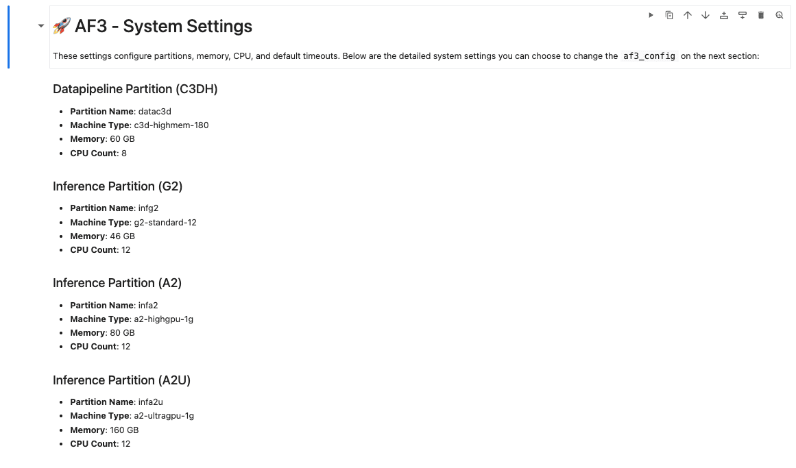
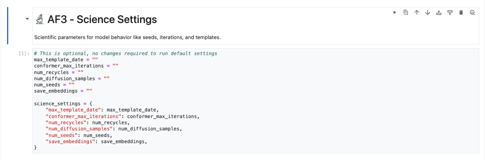

# Usage Guide: Step-by-Step Instructions

**1. Uploading the Input Data:**

Begin by uploading your input JSON file, which contains the data required by AlphaFold, either `datapipeline` or `inference` input file, to the Jupyter Notebook environment. You can usually do this using the file upload feature available within the notebook interface as shown by image below.

   

Ensure your input JSON file is placed in the correct location **relative to your Jupyter Notebook file**. Your project directory should be structured like this:

```code
alphafold/
├── <uploaded_file>.json # Your manually uploaded input file
├── fold_input_example.json # Example input file (provided)
└── slurm-rest-api-notebook.ipynb
```

When configuring your data pipeline or inference process, ensure you use the correct ***relative file path*** to reference the input JSON. To help you get started, we provide an example input file for the data pipeline process named `fold_input_example.json`.

If your input file is located in the same directory(under `/alphafold/` directory) with `fold_input_example.json`, simply update the `input_file` variable in the notebook code to reflect the name of your uploaded file:

```python
input_file= "fold_input_example.json" # Replace this with your actual file name
```

Make sure the file is properly formatted and matches the expected schema (see [AlphaFold Input Documentation](https://github.com/google-deepmind/alphafold3/blob/main/docs/input.md#alphafold-server-json-compatibility) for reference).

**2. Running the Setup Cells (including System Configuration and SLURM Initialization):**

Once the input file is uploaded, execute all the cells in the notebook that are responsible for setting up the environment, installing dependencies, and loading necessary functions. Ensure all these setup cells run without errors before proceeding to the next section.

These cells perform several crucial setup tasks:

- **Installing dependencies:** For running the notebook for the first time, make sure to install the required dependencies. This step ensures that all necessary libraries are available for the notebook to function properly.

   

- **Review System Settings:** These cells display the default configurations for SLURM partitions (Datapipeline C3DH, Inference G2/A2/A2U), memory, CPU counts, and timeout durations. While you can modify the `af3_config` later if needed, it’s important to **familiarize yourself with the default limits of each machine shape** to ensure your jobs are appropriately configured and to avoid unexpected errors—such as running out of memory, CPU limits, or hitting timeout thresholds.

  

- **Understand Science Settings:** These cells define scientific parameters for the model, such as seeds and iterations. Leaving them empty will apply AlphaFold’s default settings.

  

- **SLURM API Token Retrieval:** This cell outlines how the SLURM REST API token is retrieved from Google Secret Manager.

   

- **Hostname Retrieval:** This cell retrieve SLURM connection details (like hostname/remote IP address) from `slurm_info.json` file, which uploaded from `controller` node into current notebook bucket.

   

- **Initialize AF3SlurmClient and Test Connection:** The client is initialized, and a "Ping" command is executed to verify the connection to the SLURM REST API. A successful ping response confirms that the communication is working correctly.

   

**3. Configuring the Data Pipeline:**

- Set the `input_file` within the data pipeline cell with JSON file path you uploaded in Step 1.

   

- After updating the filename, run the data pipeline cell. This will process your input data.

- Check job status:

   

   In some cases—for example, when there are issues with node provisioning for dynamic nodes—the job status may return `PENDING` status or an error status. This is often a temporary condition (e.g., while a node is still being provisioned), so you can try running the cell again.
  
   If the issue persists, please refer to the [Known Issues & How to Fix Them](README.md#known-issues-how-to-fix-them) section for further guidance.

**4. Executing the Inference:**

- Next, locate and execute the inference cell in the notebook. This cell is configured to use the **latest output** generated by the data pipeline as its input.

   > ⚠️ **Warning:**  
   > Make sure the previous **Data Pipeline** process status is **"COMPLETED"** before running the current step — especially if you're executing the workflow as an end-to-end process.

  If you prefer to run inference on a manually uploaded file, you can set the default input `inference_input_file` variable with your own file path. Make sure that your uploaded file meets all the necessary requirements for the inference process to run correctly.

   

- Upon successful execution, the inference cell will perform the necessary calculations to predict the 3D structure and generate the PAE (Predicted Alignment Error) matrix.

- Check job status:
  
  
  In some cases—for example, when there are issues with node provisioning for dynamic nodes—the job status may return `PENDING` status or an error status. This is often a temporary condition (e.g., while a node is still being provisioned), so you can try running the cell again.
  
  If the issue persists, please refer to the [Known Issues & How to Fix Them](../readme.md#known-issues--how-to-fix-them) section for further guidance..

**5. Visualizing the Results:**

After the inference step is complete, the notebook should contain sections that allow you to visualize the results:

- **3D Structure:** To view an interactive 3D representation of the predicted structure, open the `cif` output file using the `show_structure_3d` function. This provides an interactive visualization that allows you to explore the overall structure.

   

- **PAE Matrix:** To view the PAE matrix, open the corresponding visualization output with `plot_pae_matrix` function. It provides insights into the model's confidence in the predicted relative positions of residues.

   

By following these steps, you can successfully run the end-to-end inference pipeline and visualize the predicted 3D structure and PAE matrix using the provided Jupyter Notebook.
