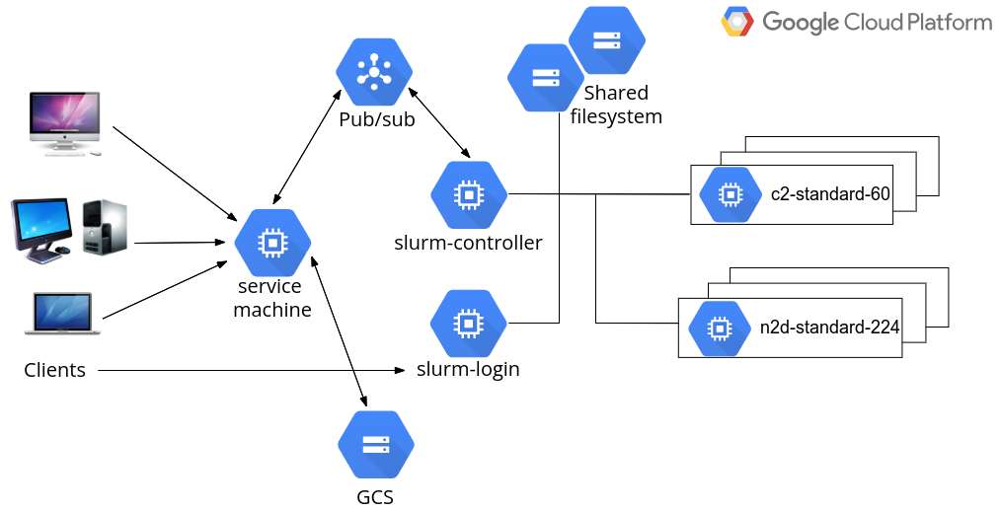
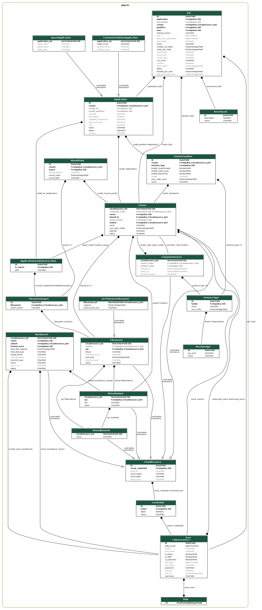

## HPC Toolkit FrontEnd - Developer’s Guide

### Architecture design

The HPC Toolkit FrontEnd is a web application integrating several front-end and back-end technologies. Django, a high-level Python-based web framework, forms the foundation of the web application. The back-end business logics can mostly be delegated to Terraform to create GCP cloud infrastructure required by the HPC clusters. With HPC Toolkit, there is no need to define infrastructure configurations from scratch. Rather, a high-level description of the clusters are provided for it to generate Terraform configurations.

The overall system design is described in the following figure. 

 <!--TODO: refine this sketch-->

In most cases, end users are expected to communicate with the cloud systems via the web front-end. Of course, users from a traditional supercomputing background may wish to work with HPC clusters from the command line. This is entirely possible and is covered in later sections.

<!--  This system is currently NOT capable of being run in parallel, so a Load Balancer will not add any benefits.

In a production environment, it is typically good practice to leave the web application behind a load balancer, which provides additional performance, scalability, and security. -->

A single compute engine virtual machine, referred to as the **service machine** from now on, should be created to host the application server, webserver and database server. In large productions, these servers can of course be hosted on different machines if required.

The web application is built upon Django, a Python framework to develop data-driven dynamic websites. A Nginx server is configured to serve the static files of the website, as well as proxying Django URLs to the application server. Application data is stored in a file-based SQLite database which can be easily replaced by a managed SQL service in large production.

From the web application, HPC clusters can be created on GCP by administrators. A typical HPC cluster contains a single Slurm controller node, and one or more login nodes, typically all running on low- to mid-range virtual machines. The controller node hosts the Slurm job
scheduler. Through the job scheduler, compute nodes can be started or terminated as required. The controller node and login nodes all provide public IP addresses for administrators or users to SSH into, although doing so is not mandatory as day-to-day tasks can be performed via the web interface.

The Slurm job scheduler supports partitions. Each partition can have compute nodes of different instance types. All major HPC capable instance types can be supported from a single cluster if so desired. Of course, it is also possible to create multiple clusters, which is entirely an
operational decision by the adminstrators.

For each cluster, two shared filesystems are created to host a system directory for applications and a home directory for users' job data. Additional filesystems can be created or imported, to be mounted to the clusters. 

For each deployment, a GCS bucket is created to hold supporting files, including configurations to build the service machine, Ansible configurations to set up various Slurm nodes. The same GCS bucket is also served as a long-term backup to application and job data, including log files for most cloud operations and selected files created by jobs.

Communication between the service machine and clusters is handled by Pub/Sub. For technical details, consult the [Cluster Command & Control](ClusterCommandControl.md) document. Alternatively, there is an API layer around Django to allow incoming communication to the service machine.

### Deploy the system

Please follow the deployment section in the [Administrator’s Guide](admin_guide.md) to deploy the system for testing and development.

### Access the service machine

By default, access to the service machine is restricted to authorised users (the owner/editor of the hosting GCP project or other users delegated with sufficient permissions). Use one of the following two methods to access the system after a new deployment:

- SSH into the service machine directly from the GCP console of the hosting GCP project.
- Edit the hosting VM instance by uploading the public SSH key of a client machine to grant SSH access.

Immediately after login, run `sudo su -l gcluster` to become the *gcluster* user. This user account was created during the deployment to be the owner of the frontend files.

### Directory structures on service machine

The home directory of the *gcluster* account is at */opt/gcluster*. For a new deployment, the following four sub-directories are created:

- *go* - the development environment of the Go programming language, required to build Google HPC Toolkit
- *hpc-toolkit* - a clone of the Google HPC Toolkit project. The *ghpc* binary should have already been built during the deployment. The *frontend* sub-directory contains the Django-based web application for the FrontEnd and other supporting files.
- *django-env* - a Python 3 virtual environment containing everything required to support Django development. To activate this environment: `source ~/django-env/bin/activate`.
- *run* -  directory for run-time data, including the following log files:
  - *nginx-access.log* - web server access log.
  - *nginx-error.log* - web server error log.
  - *supvisor.log* -  Django application server log. Python *print* from Django source files will appear in this file for debugging purposes.
  - *django.log* - additional debugging information generated by the Python logging module is writen here.

### Run-time data

#### For cloud resources

Run-time data to support creating and managing cloud resources are generated and stored in the following sub-directories within *hpc-toolkit/frontend*:

- *clusters/cluster_\<id>* - holding run-time data for a cluster. *\<id>* here has a one-to-one mapping to the IDs shown in the frontend's cluster list page. It contains the following:
  - *cluster.yaml* - input file for *ghpc*, generated based on information collected from web interface.
  - *\<cluster_name>_\<random_id>/primary* - Terraform files generated by *ghpc* to create the cluster, and log files from running `terraform init/validate/plan/apply`. Should there be a need to manually clean up the associated cloud resources, run `terraform destroy` here.
- *vpcs/vpc_\<id>* - similar to above but holding run-time data for a virtual network. Currently creating custom mode VPC is not yet supported by HPC Toolkit. A custom set of Terraform configurations are used.
- *fs/fs_\<id>* - similar to above but holding run-time data for a filesystem. Currently only GCP Filestore is supported.

#### For applications

Application data is stored in the shared filesystem `/opt/cluster`. It contains the following sub-directories:

- `/opt/cluster/spack` contains a Spack v0.17.1 installation.
- When applications are installed via the web interface, supporting files are saved in `/opt/cluster/install/<application_id>` where `<application_id>` can be located from the web interface.
  - For a Spack installation, a job script `install.sh` is generated to submit a Slurm job to the selected partition to run `spack install` of the desired package.
  - For a custom installation, a job script `install_submit.sh` is generated to submit a Slurm job to the selected partition to execute `job.sh` which contains the custom installation steps.
- After each successful installation, Spack application binaries are stored at `/opt/cluster/spack/opt/spack/linux-centos7-<arch>` where `<arch>` is the architecture of the processors on which the binaries get built, such as `cascadelake` or `zen2`.
- Standard output and error files for Slurm jobs are uploaded to the GCS bucket associated with the deployment at the following URLs: `gs://<deployment_name>-<deployment_zone>-storage/clusters/<cluster_id>/installs/<application_id>/stdout|err`.

#### For jobs

Job data is stored in the shared filesystem `/home/<username>` for each user. Here `<username>` is the OS Login username, which is generated by Google and will be different from the user's normal UNIX name. The home directories contain the following:

- When a job is submitted from the web interface, supporting files are saved in `/home/<username>/jobs/<job_id>` where `<job_id>` can be located from the web interface.
- When running a Spack application, a job script `submit.sh` is generated to submit a Slurm job. This script performs a `spack load` to set up the application environment and then invoke `job.sh` which contains the user-supplied custom commands to run the job.
- Standard output and error files for Slurm jobs are uploaded to the GCS bucket associated with the deployment at the following URLs: `gs://<deployment_name>-<deployment_zone>-storage/clusters/<cluster_id>/jobs/<job_id>/stdout|err`.

Note that a special home directory is created at `/home/root_jobs` to host jobs submitted by the Django superusers. For convenience they do not need Google identities and their jobs are run as *root* on the clusters.

---

### Django development

#### Database Design

Django is great at building data-driven applications. The major system components, such as clusters, applications, and jobs, can easily map to Django data models. The database design of this system is best shown with a UML diagram. This was generated using a function available in the Python *django-extensions* package (depending on the Python *pydotplus* package and *graphviz* package to create the image output). To generate the UML diagram, run from the command line:
```python manage.py graph_models -a -X <classes_to_exclude> -o UML_output.png```

To simplify the output and exclude the internal models coming with Django, append a list of comma-separated class names after the -X flag. The result is shown below:



Note that the *CloudResource* model is at the base of all cloud resources including network components, storage components, compute instance (representing a single VM), clusters, and Workbenches.